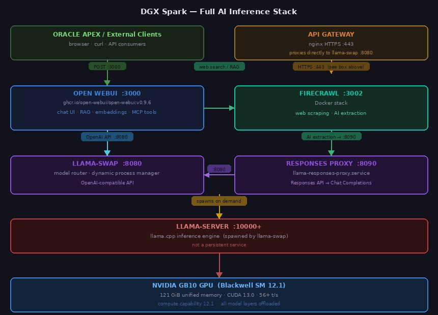

# DGX Spark — AI Inference Stack

This repository contains scripts, configuration, and documentation for the full AI inference
stack running on the **NVIDIA DGX Spark (GB10)**. The stack serves LLM inference locally,
exposes it through a web UI, and integrates with Oracle APEX.

---

## Architecture

```
Oracle APEX
    │  POST :8766
    ▼
apex-gateway.py          ← injects stream:false + chat_id
    │  POST :3000
    ▼
Open WebUI  (Docker)     ← chat interface, model management, tool calling
    │  OpenAI API :8080           │  web search / RAG loader :3002
    │                             ▼
    │                    Firecrawl  (Docker)  ← web scraping + AI extraction
    │                             │  AI extraction calls :8090
    │                             ▼
    │                    llama-responses-proxy  ← Responses API → Chat Completions
    ▼                             │
llama-swap               ← model router, dynamic process manager
    │  spawns                     │  :8080
    ▼ ←──────────────────────────-┘
llama-server             ← GPU inference engine (llama.cpp)
    │
    ▼
NVIDIA GB10 GPU          ← 121 GiB unified memory, Blackwell (SM 12.1)
```

[](docs/images/architecture.jpg)

---

## Services

| Service | Port | Description | Managed by |
|---|---|---|---|
| `llama-swap` | 8080 | Model router — OpenAI-compatible API, dynamic model loading | systemd |
| `openwebui` | 3000 | Web chat interface (Docker container) | systemd |
| `apex-gateway` | 8766 | HTTP proxy adapting Oracle APEX requests for Open WebUI | systemd |
| `llama-responses-proxy` | 8090 | Translates OpenAI Responses API → Chat Completions for llama-swap | systemd |
| `firecrawl` (Docker stack) | 3002 | Web scraping and AI-powered structured extraction | `init.firecrawl` |
| `llama-server` | 10000 | GPU inference engine — **not a persistent service**; spawned and managed on demand by llama-swap | llama-swap |

Check all services at once:

```bash
init.status
```

> **Note:** `llama-server` will show as `STOPPED` in `init.status` — this is expected. llama-swap spawns and terminates llama-server processes on demand as models are loaded and unloaded; it is not a persistent service.

---

## Quick Reference

| Task | Command |
|---|---|
| Check all services | `init.status` |
| Restart llama-swap | `init.llama-swap restart` |
| Restart Open WebUI | `init.openwebui restart` |
| Restart APEX gateway | `init.apex-gateway restart` |
| Restart Firecrawl | `init.firecrawl restart` |
| Run a model benchmark | `python3 benchmark_models.py --models gpt-oss-120b` |
| View llama-swap logs | `init.llama-swap logs` |
| View Open WebUI logs | `init.openwebui logs` |
| View Firecrawl logs | `init.firecrawl logs` |

---

## Documentation

All installation and operational guides are in [`docs/`](docs/).

### Installation Guides

| Guide | Description |
|---|---|
| [`docs/prerequisites.md`](docs/prerequisites.md) | All required software — install this first. Covers apt packages, CUDA, Go, Docker, Miniforge, and Hugging Face auth. |
| [`docs/llama-server.md`](docs/llama-server.md) | Build llama.cpp from source with optimised CMake flags for the GB10 (ARM KleidiAI, CUDA FA, LTO), install the binary, configure the standalone systemd service. |
| [`docs/llama-swap.md`](docs/llama-swap.md) | Install and configure llama-swap — full annotated config YAML, 7 registered models, arg macro reference, model download instructions, systemd unit. |
| [`docs/openwebui.md`](docs/openwebui.md) | Deploy Open WebUI in Docker, connect to llama-swap, set context windows per model, register MCP tool servers, configure Firecrawl web search and URL RAG, upgrade procedure. |
| [`docs/apex-gateway.md`](docs/apex-gateway.md) | Deploy the APEX Gateway proxy — full Python source, systemd unit, Oracle APEX configuration, request flow diagram. |
| [`docs/Firecrawl.md`](docs/Firecrawl.md) | Self-hosted Firecrawl setup — Docker Compose stack, llama-responses-proxy, AI extraction config, Open WebUI integration. |
| [`docs/lmstudio.md`](docs/lmstudio.md) | LM Studio optional inference tool — daemon management, model loading, inference server on :9000, full `init.lmstudio` script. |

### Benchmarking

| Guide | Description |
|---|---|
| [`docs/benchmark-guide.md`](docs/benchmark-guide.md) | How to run the benchmark script — CLI reference, metric definitions, examples, tips specific to this setup. |
| [`docs/benchmark_all_models.md`](docs/benchmark_all_models.md) | Full benchmark of all 7 registered models (2026-06-25, 3 iterations). Results summary, comparison charts, per-model detail, and model selection guide. |
| [`docs/benchmark_gpt-oss-120b.md`](docs/benchmark_gpt-oss-120b.md) | Detailed single-model benchmark for `gpt-oss-120b` (2026-06-25, 3 iterations). |

---

## Hardware

| Component | Detail |
|---|---|
| Platform | NVIDIA DGX Spark (GB10) |
| CPU | ARM aarch64 — 10× Cortex-X925 + 10× Cortex-A725 |
| Memory | 121 GiB unified (CPU + GPU share same pool) |
| GPU | NVIDIA GB10, compute capability 12.1 (Blackwell) |
| CUDA | 13.0, driver 580.159.03 |
| Storage | 3.7 TB NVMe |

---

## Models

7 models are registered in llama-swap, selected from the full benchmark run (2026-06-24) as the
highest-value set across quality tiers. The default model (`gpt-oss-120b`) loads at service start
and stays resident. All others load on demand.

| Model | Size | Speed | Why kept |
|---|---|---|---|
| `gpt-oss-120b` | 120B MXFP4 | **56.2 t/s** | **Default — loads at startup.** Clear quality leader; OpenAI open-source arch, 131K ctx, ~60 GB. Fastest high-quality model on this machine. |
| `Qwen3-72B` | 72B Q5_K_M | 3.8 t/s | Best general-purpose 72B. Qwen3 generation outperforms Qwen2.5 at the same parameter count across MMLU, reasoning, and instruction-following benchmarks. |
| `DeepSeek-R1-70B` | 70B Q5_K_M | 4.0 t/s | Best reasoning model in the lineup. Chain-of-thought distill of DeepSeek R1 on a Llama-70B base — strong on multi-step reasoning, math, and debugging. |
| `Qwen2.5-Coder-32B` | 32B Q8_0 | 6.5 t/s | Best dedicated code model. Q8_0 near-lossless precision, 128K native context. Purpose-trained on code and outperforms larger general models on HumanEval/code tasks. |
| `Nemotron-Nano-Omni-30B` | 30B Q8_0 | 57.3 t/s | Only model with image input support (`--mmproj`). Vision + reasoning in one; kept for multimodal tasks. |
| `Codestral-22B` | 22B Q8_0 | 9.5 t/s | Mistral-trained SQL and code specialist. Strongest model for structured queries; complements the general coder. |
| `Qwen3.5-9B` | 9B Q8_0 | 24.2 t/s | Fast lightweight tier. Full Q8_0 precision at 9B; best choice for quick tasks, latency-sensitive requests, or when the 70B+ models are busy. |

Benchmark results and full model history: [`docs/benchmark_all_models.md`](docs/benchmark_all_models.md) · [`docs/llama-swap.md`](docs/llama-swap.md)

---

## init.status Script Source

`init.status` is the combined health dashboard for all services:

```bash
sudo tee /home/sysadmin/codebase/bin/init.status > /dev/null << 'STATUSEOF'
#!/usr/bin/env bash
# Comprehensive status for all managed services on the DGX Spark

BOLD='\033[1m'; RESET='\033[0m'; GREEN='\033[0;32m'; RED='\033[0;31m'
YELLOW='\033[0;33m'; CYAN='\033[0;36m'; DIM='\033[2m'
LINE='────────────────────────────────────────────────────────────────────────────────'
THIN='╌╌╌╌╌╌╌╌╌╌╌╌╌╌╌╌╌╌╌╌╌╌╌╌╌╌╌╌╌╌╌╌╌╌╌╌╌╌╌╌╌╌╌╌╌╌╌╌╌╌╌╌╌╌╌╌╌╌╌╌╌╌╌╌╌╌╌╌╌╌╌╌╌╌╌╌╌╌╌╌'

bytes_to_gib() {
    local b="$1"
    if [[ "$b" =~ ^[0-9]+$ ]] && (( b > 1048576 )); then
        awk "BEGIN{printf \"%.1f GiB\", $b/1073741824}"
    else echo "—"; fi
}

svc_state() {
    local active sub
    active=$(systemctl show "$1" --property=ActiveState --value 2>/dev/null)
    sub=$(systemctl show "$1" --property=SubState --value 2>/dev/null)
    echo "${active}:${sub}"
}
svc_since() {
    systemctl show "$1" --property=ActiveEnterTimestamp --value 2>/dev/null \
        | sed 's/ [A-Z]*$//' | sed 's/^[A-Z]* //'
}
svc_mem() { bytes_to_gib "$(systemctl show "$1" --property=MemoryCurrent --value 2>/dev/null)"; }
svc_pid() { systemctl show "$1" --property=MainPID --value 2>/dev/null; }

state_label() {
    case "$1" in
        active:running)  printf "${GREEN}${BOLD}RUNNING${RESET}" ;;
        active:exited)   printf "${YELLOW}${BOLD}EXITED ${RESET}" ;;
        inactive:dead)   printf "${RED}${BOLD}STOPPED${RESET}" ;;
        failed:*)        printf "${RED}${BOLD}FAILED ${RESET}" ;;
        *)               printf "${YELLOW}${BOLD}UNKNOWN${RESET}" ;;
    esac
}

health_check() {
    local url="$1" skip="$2"
    [[ "$skip" == "skip" ]] && return
    local code
    code=$(curl -s -o /dev/null -w "%{http_code}" --max-time 2 "$url" 2>/dev/null)
    if [[ "$code" =~ ^[23] ]]; then
        printf "${DIM}  %-20s  health ${GREEN}%-3s OK${RESET}${DIM}  %s${RESET}\n" "" "$code" "$url"
    elif [[ "$code" == "000" ]]; then
        printf "${DIM}  %-20s  health ${RED}%-6s${RESET}${DIM}  %s${RESET}\n" "" "no conn" "$url"
    else
        printf "${DIM}  %-20s  health ${YELLOW}%-6s${RESET}${DIM}  %s${RESET}\n" "" "$code" "$url"
    fi
}

print_service() {
    local name="$1" unit="$2" port="$3" url="$4" skip_health="$5"
    local state since mem pid port_color
    state=$(svc_state "$unit"); since=$(svc_since "$unit")
    mem=$(svc_mem "$unit"); pid=$(svc_pid "$unit")
    if ss -tlnp 2>/dev/null | grep -q ":${port} "; then
        port_color="${GREEN}:${port}${RESET}"
    else
        port_color="${RED}:${port} (not listening)${RESET}"
    fi
    printf "  ${BOLD}%-20s${RESET}  " "$name"
    printf "$(state_label "$state")"
    printf "   port "; printf "${port_color}"
    printf "   mem %-10s  pid %s\n" "$mem" "$pid"
    health_check "$url" "$skip_health"
    [[ -n "$since" ]] && printf "${DIM}  %-20s  since  %s${RESET}\n" "" "$since"
}

printf "\n${CYAN}${BOLD}  DGX SPARK — SERVICE STATUS   %s${RESET}\n" "$(date '+%Y-%m-%d %H:%M:%S')"
printf "${CYAN}${LINE}${RESET}\n"

print_service "llama-swap"            "llama-swap.service"            "8080"  "http://localhost:8080/v1/models"
printf "${DIM}  ${THIN}${RESET}\n"
print_service "openwebui"             "openwebui.service"             "3000"  "http://localhost:3000/health"
owui_docker=$(docker ps --filter "name=^openwebui$" \
    --format "{{.Image}}   up {{.RunningFor}}   {{.Status}}" 2>/dev/null)
if [[ -n "$owui_docker" ]]; then
    printf "${DIM}  %-20s  docker  %s${RESET}\n" "" "$owui_docker"
else
    printf "${DIM}  %-20s  docker  ${RED}container not found${RESET}\n" ""
fi
printf "${DIM}  ${THIN}${RESET}\n"
print_service "apex-gateway"          "apex-gateway.service"          "8766"  "" "skip"
printf "${DIM}  ${THIN}${RESET}\n"
print_service "llama-responses-proxy" "llama-responses-proxy.service" "8090"  "" "skip"
printf "${DIM}  ${THIN}${RESET}\n"
print_service "llama-server"          "llama-server.service"          "10000" "http://localhost:10000/health"
printf "${DIM}  %-20s  ${YELLOW}↑ managed by llama-swap — spawned on demand, not a persistent service${RESET}\n" ""
printf "${CYAN}${LINE}${RESET}\n"

printf "\n${CYAN}${BOLD}  FIRECRAWL (Docker)${RESET}\n"
printf "${CYAN}${LINE}${RESET}\n"

fc_health=$(curl -s -o /dev/null -w "%{http_code}" --max-time 4 \
    -X POST http://localhost:3002/v2/scrape \
    -H "Content-Type: application/json" \
    -d '{"url":"https://example.com","formats":["markdown"]}' 2>/dev/null)

if [[ "$fc_health" =~ ^2 ]]; then
    printf "  ${BOLD}%-20s${RESET}  ${GREEN}${BOLD}RUNNING${RESET}   port ${GREEN}:3002${RESET}   health ${GREEN}%s OK${RESET}\n" "firecrawl" "$fc_health"
else
    printf "  ${BOLD}%-20s${RESET}  ${RED}${BOLD}STOPPED${RESET}   port ${RED}:3002 (not responding)${RESET}   health ${RED}%s${RESET}\n" "firecrawl" "${fc_health:-no conn}"
fi

docker ps --filter "name=firecrawl" \
    --format "{{.Names}}\t{{.Image}}\t{{.RunningFor}}\t{{.Status}}" 2>/dev/null \
    | while IFS=$'\t' read -r name image ran status; do
        info="${image}   up ${ran}   ${status}"
        if [[ "$status" == *"Up"* ]]; then
            printf "${DIM}  %-34s  docker  ${GREEN}%s${RESET}\n" "$name" "$info"
        else
            printf "${DIM}  %-34s  docker  ${RED}%s${RESET}\n" "$name" "$info"
        fi
    done

printf "${CYAN}${LINE}${RESET}\n"

running_json=$(curl -s --max-time 3 http://localhost:8080/running 2>/dev/null)
model_count=$(curl -s --max-time 3 http://localhost:8080/v1/models 2>/dev/null \
    | python3 -c "import json,sys; d=json.load(sys.stdin); print(len(d.get('data',[])))" 2>/dev/null)

printf "\n${CYAN}${BOLD}  LOADED MODELS (llama-swap)${RESET}   ${DIM}${model_count:-?} registered total${RESET}\n"
printf "${CYAN}${LINE}${RESET}\n"

if [[ -z "$running_json" ]]; then
    printf "  ${YELLOW}llama-swap not reachable${RESET}\n"
else
    tmp_json=$(mktemp)
    echo "$running_json" > "$tmp_json"
    python3 << PYEOF
import json, sys
GREEN='\033[0;32m'; YELLOW='\033[0;33m'; BOLD='\033[1m'; DIM='\033[2m'; RESET='\033[0m'
try:
    with open('$tmp_json') as f:
        data = json.load(f)
except Exception as e:
    print(f"  {YELLOW}Error reading model data: {e}{RESET}"); sys.exit(0)
models = data.get('running', [])
if not models:
    print(f"  {DIM}No models currently loaded{RESET}")
else:
    for m in models:
        model=m.get('model','?'); name=m.get('name',model); state=m.get('state','?')
        proxy=m.get('proxy','—'); ttl=m.get('ttl',0); cmd=m.get('cmd','')
        ctx='—'; toks=cmd.split()
        for i,tok in enumerate(toks):
            if tok=='--ctx-size' and i+1<len(toks):
                try: ctx=f"{int(toks[i+1]):,} ctx"
                except ValueError: pass
                break
        port=proxy.split(':')[-1] if proxy not in ('—','') else '—'
        state_color=GREEN if state=='ready' else YELLOW
        ttl_str='resident (no TTL)' if ttl==0 else f'TTL {ttl}s'
        print(f"  {BOLD}{name:<32}{RESET}  {state_color}{state:<8}{RESET}  port :{port}  {ctx}")
        print(f"  {DIM}{'':32}  {ttl_str}{RESET}")
PYEOF
    rm -f "$tmp_json"
fi

printf "${CYAN}${LINE}${RESET}\n"

if command -v nvidia-smi &>/dev/null; then
    printf "\n${CYAN}${BOLD}  GPU${RESET}\n"
    printf "${CYAN}${LINE}${RESET}\n"
    gpu_info=$(nvidia-smi --query-gpu=name,utilization.gpu,temperature.gpu,power.draw \
        --format=csv,noheader,nounits 2>/dev/null)
    total_mem_gib=$(free -g 2>/dev/null | awk '/^Mem:/{print $2}')
    while IFS=',' read -r gname gpuutil temp power; do
        gname=$(echo "$gname" | xargs); gpuutil=$(echo "$gpuutil" | xargs)
        temp=$(echo "$temp" | xargs); power=$(echo "$power" | xargs)
        printf "  ${BOLD}%-30s${RESET}  GPU %s%%   Temp %s°C   Power %s W   Unified RAM %s GiB\n" \
            "$gname" "$gpuutil" "$temp" "$power" "${total_mem_gib:-121}"
    done <<< "$gpu_info"
    printf "${CYAN}${LINE}${RESET}\n"
fi

printf "\n"
STATUSEOF
sudo chmod 755 /home/sysadmin/codebase/bin/init.status
```

---

## sync.documentation.sh

`sync.documentation.sh` syncs docs and scripts from this machine to a remote host (e.g. a MacBook) using a multiplexed SSH connection. Edit the three variables at the top before use.

```bash
tee /home/sysadmin/codebase/bin/sync.documentation.sh > /dev/null << 'EOF'
#!/bin/bash
set -euo pipefail

REMOTE_USER="admin"                           # username on the remote machine
REMOTE_HOST="192.168.X.X"                    # LAN IP of the remote machine
REMOTE_DIR="/Users/admin/Documents/GitHub/nvidia-dgx-spark-setup"

CONTROL_PATH="/tmp/ssh-mux-%r@%h:%p"
SSH_OPTS=(-o ControlMaster=auto -o ControlPath="${CONTROL_PATH}" -o ControlPersist=60)

# Open one shared connection (prompts for password once) and keep it alive
ssh "${SSH_OPTS[@]}" -fN "${REMOTE_USER}@${REMOTE_HOST}"

cleanup() {
  ssh "${SSH_OPTS[@]}" -O exit "${REMOTE_USER}@${REMOTE_HOST}" 2>/dev/null || true
}
trap cleanup EXIT

scp -o ControlPath="${CONTROL_PATH}" README.md "${REMOTE_USER}@${REMOTE_HOST}:${REMOTE_DIR}/."
scp -o ControlPath="${CONTROL_PATH}" -r docs/* "${REMOTE_USER}@${REMOTE_HOST}:${REMOTE_DIR}/docs/."
scp -o ControlPath="${CONTROL_PATH}" *.py "${REMOTE_USER}@${REMOTE_HOST}:${REMOTE_DIR}/code/."
scp -o ControlPath="${CONTROL_PATH}" init* "${REMOTE_USER}@${REMOTE_HOST}:${REMOTE_DIR}/code/."

echo "Sync complete."
EOF
chmod 755 /home/sysadmin/codebase/bin/sync.documentation.sh
```

Usage:

```bash
cd /home/sysadmin/codebase/bin
# Edit REMOTE_USER / REMOTE_HOST / REMOTE_DIR at the top of the script first
./sync.documentation.sh
```

---

## Key Paths

| Path | Purpose |
|---|---|
| `/etc/default/llama-swap.yaml` | llama-swap config (models, macros, TTL) |
| `/usr/local/bin/llama-swap` | llama-swap binary |
| `/usr/local/bin/llama-server` | llama-server binary (built from llama.cpp) |
| `~/codebase/llama.cpp/` | llama.cpp source repository |
| `~/codebase/models/gguf/` | Model files (model-shelf layout: `<org>/<repo>/`) |
| `/home/sysadmin/codebase/bin/apex.gateway.py` | APEX Gateway script |
| `/home/sysadmin/codebase/firecrawl/` | Firecrawl repo and Docker Compose stack |
| `/home/sysadmin/codebase/firecrawl/.env` | Firecrawl environment config |
| `/home/sysadmin/codebase/bin/llama-responses-proxy.py` | Responses API → Chat Completions proxy |
| `/etc/systemd/system/llama-responses-proxy.service` | Proxy systemd unit |
| `/var/log/llama/` | llama-server and llama-swap logs |
| `/var/log/openwebui/` | Open WebUI logs |
| `/var/log/apex-gateway/` | APEX Gateway logs |
