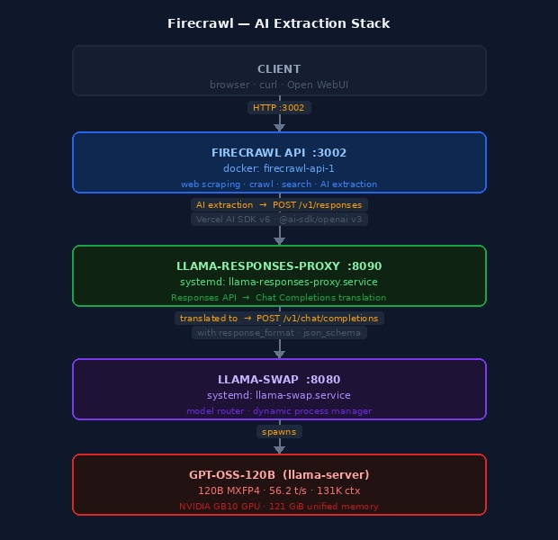

# Firecrawl

Self-hosted web scraping and AI extraction service running via Docker Compose, backed by the local llama-swap LLM stack.

## Overview

[Firecrawl](https://github.com/mendableai/firecrawl) converts any URL into clean markdown or structured JSON. The local setup uses pre-built images (no local build step) and routes AI extraction calls through `gpt-oss-120b` via llama-swap.

```
Client
  │
  ▼
Firecrawl API  :3002   (docker: firecrawl-api-1)
  │  AI extraction calls  →  /v1/responses
  ▼
llama-responses-proxy  :8090   (systemd)
  │  translated to  →  /v1/chat/completions
  ▼
llama-swap  :8080
  │
  ▼
gpt-oss-120b  (llama-server)
```

[](images/firecrawl-architecture.jpg)

### Why the proxy?

Firecrawl uses Vercel AI SDK v6 (`@ai-sdk/openai` v3), which sends all structured-output requests to the OpenAI **Responses API** (`POST /v1/responses`). llama-server implements this endpoint but ignores the `text.format.json_schema` field, returning plain text instead of JSON. The proxy intercepts Responses API calls, converts them to Chat Completions format (which llama-server handles correctly), and converts the response back.

---

## Fresh Install

### 1. Clone the Firecrawl repo

```bash
cd ~/codebase
git clone https://github.com/mendableai/firecrawl
cd firecrawl
```

### 2. Switch to pre-built images (no local build)

Edit `docker-compose.yaml` — comment out the three `build:` lines and uncomment the `image:` lines for the Firecrawl-specific services:

```bash
# x-common-service block: comment out build, uncomment image
sed -i 's|^  # image: ghcr.io/firecrawl/firecrawl|  image: ghcr.io/firecrawl/firecrawl|' docker-compose.yaml
sed -i 's|^  build: apps/api|  # build: apps/api|' docker-compose.yaml

# playwright-service: comment out build, uncomment image
sed -i 's|^    # image: ghcr.io/firecrawl/playwright-service:latest|    image: ghcr.io/firecrawl/playwright-service:latest|' docker-compose.yaml
sed -i 's|^    build: apps/playwright-service-ts|    # build: apps/playwright-service-ts|' docker-compose.yaml

# nuq-postgres: comment out build, uncomment image
sed -i 's|^    # image: ghcr.io/firecrawl/nuq-postgres:latest|    image: ghcr.io/firecrawl/nuq-postgres:latest|' docker-compose.yaml
sed -i 's|^    build: apps/nuq-postgres|    # build: apps/nuq-postgres|' docker-compose.yaml
```

Alternatively edit manually — look for the three `build:` directives and swap them for `image:` as documented in the [Docker Compose Stack](#docker-compose-stack) section below.

Also add `restart: unless-stopped` to every service (the `x-common-service` anchor covers `api`; the others need it individually). The `foundationdb-init` container is a one-shot initialiser and must keep `restart: "no"`. See the full file in the [Docker Compose Stack](#docker-compose-stack) section.

### 3. Create the `.env` file

```bash
cat > ~/codebase/firecrawl/.env << 'EOF'
PORT=3002
HOST=0.0.0.0
USE_DB_AUTHENTICATION=false
BULL_AUTH_KEY=CHANGEME

# AI extraction — routed through llama-responses-proxy → llama-swap
OPENAI_BASE_URL=http://host.docker.internal:8090/v1
OPENAI_API_KEY=not-needed
MODEL_NAME=gpt-oss-120b
EOF
```

### 4. Install the llama-responses-proxy

The proxy translates Firecrawl's Responses API calls into Chat Completions for llama-swap.

```bash
# The script is already in the bin repo — just install the systemd unit
sudo tee /etc/systemd/system/llama-responses-proxy.service > /dev/null << 'EOF'
[Unit]
Description=llama Responses API → Chat Completions proxy (Firecrawl compat)
After=network.target llama-swap.service

[Service]
ExecStart=/usr/bin/python3 /home/sysadmin/codebase/bin/llama-responses-proxy.py
Restart=always
User=sysadmin

[Install]
WantedBy=multi-user.target
EOF

sudo systemctl daemon-reload
sudo systemctl enable llama-responses-proxy.service
```

### 5. Start the stack

```bash
init.firecrawl start
```

This starts the proxy first, then the Docker Compose stack. Verify with:

```bash
init.firecrawl status
```

The API health check should return `200 OK` within ~30 seconds as containers initialise.

### 6. Test

```bash
# Basic scrape
curl -s http://localhost:3002/v2/scrape \
  -H "Content-Type: application/json" \
  -d '{"url":"https://example.com","formats":["markdown"]}' \
  | python3 -c "import sys,json; d=json.load(sys.stdin); print('ok:', d['success'], '— chars:', len(d['data']['markdown']))"

# AI extraction
curl -s http://localhost:3002/v2/scrape \
  -H "Content-Type: application/json" \
  -d '{
    "url": "https://example.com",
    "formats": [{"type":"json","prompt":"Extract the page title.",
      "schema":{"type":"object","additionalProperties":false,
        "required":["title"],"properties":{"title":{"type":"string"}}}}]
  }' | python3 -c "import sys,json; d=json.load(sys.stdin); print('json:', d['data']['json'])"
```

---

## Locations

| Item | Path |
|---|---|
| Repo | `/home/sysadmin/codebase/firecrawl/` |
| Config | `/home/sysadmin/codebase/firecrawl/.env` |
| Proxy script | `/home/sysadmin/codebase/bin/llama-responses-proxy.py` |
| Proxy unit | `/etc/systemd/system/llama-responses-proxy.service` |
| Manager script | `/home/sysadmin/codebase/bin/init.firecrawl` |

---

## Service Management

```bash
init.firecrawl start        # start proxy + docker stack
init.firecrawl stop         # stop stack + proxy
init.firecrawl restart      # stop then start
init.firecrawl status       # proxy status, container list, API health check
init.firecrawl logs         # tail Firecrawl API container logs
init.firecrawl logs proxy   # tail llama-responses-proxy logs
```

The proxy is a standalone systemd service and can also be managed directly:

```bash
sudo systemctl status llama-responses-proxy.service
sudo systemctl restart llama-responses-proxy.service
```

### init.firecrawl script source

```bash
sudo tee /home/sysadmin/codebase/bin/init.firecrawl > /dev/null << 'EOF'
#!/usr/bin/env bash
# =============================================================================
# init.firecrawl — Firecrawl Service Manager
# Manages the Firecrawl Docker Compose stack and its llama-responses-proxy
# dependency (Responses API → Chat Completions translation layer).
# =============================================================================
set -euo pipefail

COMPOSE_DIR="/home/sysadmin/codebase/firecrawl"
PROXY_SERVICE="llama-responses-proxy.service"
API_CONTAINER="firecrawl-api-1"

RED='\033[0;31m'; GREEN='\033[0;32m'; YELLOW='\033[1;33m'
CYAN='\033[0;36m'; BOLD='\033[1m'; RESET='\033[0m'

info()    { echo -e "${CYAN}[INFO]${RESET}  $*"; }
success() { echo -e "${GREEN}[OK]${RESET}    $*"; }
warn()    { echo -e "${YELLOW}[WARN]${RESET}  $*"; }
error()   { echo -e "${RED}[ERROR]${RESET} $*" >&2; }
die()     { error "$*"; exit 1; }
separator() { echo -e "${CYAN}$(printf '─%.0s' {1..60})${RESET}"; }
require_systemctl() { command -v systemctl &>/dev/null || die "systemctl not found."; }
require_docker()    { command -v docker &>/dev/null || die "docker not found."; }

usage() {
    echo -e ""
    echo -e "${BOLD}init.firecrawl${RESET} — Firecrawl Service Manager"
    echo -e ""
    echo -e "${BOLD}USAGE${RESET}"
    echo -e "  init.firecrawl <command>"
    echo -e ""
    echo -e "${BOLD}COMMANDS${RESET}"
    echo -e "  start         Start proxy then bring up Firecrawl stack"
    echo -e "  stop          Bring down Firecrawl stack then stop proxy"
    echo -e "  restart       Restart both (stop then start)"
    echo -e "  status        Show proxy and container status"
    echo -e "  logs          Tail Firecrawl API logs  (Ctrl-C to exit)"
    echo -e "  logs proxy    Tail llama-responses-proxy logs  (Ctrl-C to exit)"
    echo -e "  help          Show this help message"
    echo -e ""
    echo -e "${BOLD}FILES${RESET}"
    echo -e "  Compose dir:  ${COMPOSE_DIR}"
    echo -e "  Config:       ${COMPOSE_DIR}/.env"
    echo -e "  Proxy:        /home/sysadmin/codebase/bin/llama-responses-proxy.py"
    echo -e ""
    echo -e "${BOLD}API${RESET}"
    echo -e "  http://localhost:3002"
    echo -e ""
}

cmd_start() {
    info "Starting ${PROXY_SERVICE}…"
    sudo systemctl start "$PROXY_SERVICE" \
        && success "Proxy started." \
        || die "Failed to start ${PROXY_SERVICE}."
    separator
    info "Bringing up Firecrawl stack…"
    docker compose -f "${COMPOSE_DIR}/docker-compose.yaml" \
        --env-file "${COMPOSE_DIR}/.env" up -d \
        2>&1 | grep -v "^time=.*level=warning" || die "docker compose up failed."
    success "Firecrawl stack up."
    separator
    cmd_status
}

cmd_stop() {
    info "Bringing down Firecrawl stack…"
    docker compose -f "${COMPOSE_DIR}/docker-compose.yaml" \
        --env-file "${COMPOSE_DIR}/.env" down \
        2>&1 | grep -v "^time=.*level=warning" || warn "docker compose down had errors."
    success "Firecrawl stack down."
    separator
    info "Stopping ${PROXY_SERVICE}…"
    sudo systemctl stop "$PROXY_SERVICE" \
        && success "Proxy stopped." \
        || warn "Failed to stop ${PROXY_SERVICE} (may already be stopped)."
}

cmd_restart() { cmd_stop; separator; cmd_start; }

cmd_status() {
    info "Proxy — ${PROXY_SERVICE}:"
    separator
    sudo systemctl status "$PROXY_SERVICE" --no-pager -l || true
    separator
    info "Firecrawl containers:"
    docker compose -f "${COMPOSE_DIR}/docker-compose.yaml" \
        --env-file "${COMPOSE_DIR}/.env" ps \
        2>&1 | grep -v "^time=.*level=warning" || true
    separator
    info "API health check:"
    if curl -sf http://localhost:3002/v1/scrape \
            -H "Content-Type: application/json" \
            -d '{"url":"https://example.com","formats":["markdown"]}' \
            -o /dev/null --max-time 10 2>/dev/null; then
        success "API is responding on :3002"
    else
        warn "API not responding (may still be starting)"
    fi
    separator
}

cmd_logs() {
    local target="${1:-api}"
    case "$target" in
        proxy)
            info "Tailing ${PROXY_SERVICE} logs  (Ctrl-C to exit)"
            separator
            sudo journalctl -u "$PROXY_SERVICE" -f --no-pager
            ;;
        api|*)
            info "Tailing ${API_CONTAINER} logs  (Ctrl-C to exit)"
            separator
            docker logs -f "$API_CONTAINER" 2>&1 | grep -v "^time=.*level=warning"
            ;;
    esac
}

main() {
    require_systemctl
    require_docker
    local command="${1:-help}"
    shift || true
    case "$command" in
        start)           cmd_start         ;;
        stop)            cmd_stop          ;;
        restart)         cmd_restart       ;;
        status)          cmd_status        ;;
        logs)            cmd_logs "${1:-}" ;;
        help|--help|-h)  usage             ;;
        *)
            error "Unknown command: '$command'"
            usage; exit 1
            ;;
    esac
}
main "$@"
EOF
sudo chmod 755 /home/sysadmin/codebase/bin/init.firecrawl
```

---

## Configuration

**`/home/sysadmin/codebase/firecrawl/.env`**

```env
PORT=3002
HOST=0.0.0.0
USE_DB_AUTHENTICATION=false
BULL_AUTH_KEY=CHANGEME

# AI extraction — routed through llama-responses-proxy → llama-swap
OPENAI_BASE_URL=http://host.docker.internal:8090/v1
OPENAI_API_KEY=not-needed
MODEL_NAME=gpt-oss-120b
```

`OPENAI_BASE_URL` points to the proxy on port 8090 (not llama-swap directly on 8080). `MODEL_NAME` must be a model registered in llama-swap; it is also used as the model label in every LLM call so pricing lookup warnings for unknown names are harmless.

---

## Docker Compose Stack

Six containers, all using pre-built `ghcr.io/firecrawl/` images (no local build):

| Container | Image | Role |
|---|---|---|
| `firecrawl-api-1` | `ghcr.io/firecrawl/firecrawl` | API + queue workers |
| `firecrawl-playwright-service-1` | `ghcr.io/firecrawl/playwright-service:latest` | Headless browser scraping |
| `firecrawl-nuq-postgres-1` | `ghcr.io/firecrawl/nuq-postgres:latest` | Job queue persistence |
| `firecrawl-redis-1` | `redis:alpine` | Rate limiting / caching |
| `firecrawl-rabbitmq-1` | `rabbitmq:3-management` | Job queue broker |
| `firecrawl-foundationdb-1` | `foundationdb/foundationdb:7.3.63` | Experimental queue backend |

The `build:` directives in `docker-compose.yaml` are commented out and replaced with `image:` for all three Firecrawl-specific services.

### docker-compose.yaml

Full file as deployed at `/home/sysadmin/codebase/firecrawl/docker-compose.yaml` (after applying the `image:` swap from §2 of Fresh Install):

```yaml
name: firecrawl

x-common-service: &common-service
  image: ghcr.io/firecrawl/firecrawl
  # build: apps/api   ← commented out; use pre-built image
  restart: unless-stopped
  ulimits:
    nofile:
      soft: 65535
      hard: 65535
  networks:
    - backend
  extra_hosts:
    - "host.docker.internal:host-gateway"
  logging:
    driver: "json-file"
    options:
      max-size: "10m"
      max-file: "3"
      compress: "true"

x-common-env: &common-env
  REDIS_URL: ${REDIS_URL:-redis://redis:6379}
  REDIS_RATE_LIMIT_URL: ${REDIS_URL:-redis://redis:6379}
  PLAYWRIGHT_MICROSERVICE_URL: ${PLAYWRIGHT_MICROSERVICE_URL:-http://playwright-service:3000/scrape}
  POSTGRES_USER: ${POSTGRES_USER:-postgres}
  POSTGRES_PASSWORD: "${POSTGRES_PASSWORD:-postgres}"
  POSTGRES_DB: ${POSTGRES_DB:-postgres}
  POSTGRES_HOST: ${POSTGRES_HOST:-nuq-postgres}
  POSTGRES_PORT: ${POSTGRES_PORT:-5432}
  USE_DB_AUTHENTICATION: ${USE_DB_AUTHENTICATION:-false}
  NUM_WORKERS_PER_QUEUE: ${NUM_WORKERS_PER_QUEUE:-8}
  CRAWL_CONCURRENT_REQUESTS: ${CRAWL_CONCURRENT_REQUESTS:-10}
  MAX_CONCURRENT_JOBS: ${MAX_CONCURRENT_JOBS:-5}
  BROWSER_POOL_SIZE: ${BROWSER_POOL_SIZE:-5}
  OPENAI_API_KEY: ${OPENAI_API_KEY}
  OPENAI_BASE_URL: ${OPENAI_BASE_URL}
  MODEL_NAME: ${MODEL_NAME}
  MODEL_EMBEDDING_NAME: ${MODEL_EMBEDDING_NAME}
  OLLAMA_BASE_URL: ${OLLAMA_BASE_URL}
  AUTUMN_SECRET_KEY: ${AUTUMN_SECRET_KEY}
  SLACK_WEBHOOK_URL: ${SLACK_WEBHOOK_URL}
  BULL_AUTH_KEY: ${BULL_AUTH_KEY}
  TEST_API_KEY: ${TEST_API_KEY}
  SUPABASE_ANON_TOKEN: ${SUPABASE_ANON_TOKEN}
  SUPABASE_URL: ${SUPABASE_URL}
  SUPABASE_SERVICE_TOKEN: ${SUPABASE_SERVICE_TOKEN}
  SELF_HOSTED_WEBHOOK_URL: ${SELF_HOSTED_WEBHOOK_URL}
  LOGGING_LEVEL: ${LOGGING_LEVEL}
  PROXY_SERVER: ${PROXY_SERVER}
  PROXY_USERNAME: ${PROXY_USERNAME}
  PROXY_PASSWORD: ${PROXY_PASSWORD}
  SEARXNG_ENDPOINT: ${SEARXNG_ENDPOINT}
  SEARXNG_ENGINES: ${SEARXNG_ENGINES}
  SEARXNG_CATEGORIES: ${SEARXNG_CATEGORIES}
  NUQ_BACKEND: ${NUQ_BACKEND}
  FDB_CLUSTER_FILE: ${NUQ_BACKEND:+/var/fdb/fdb.cluster}

services:
  playwright-service:
    image: ghcr.io/firecrawl/playwright-service:latest
    # build: apps/playwright-service-ts   ← commented out
    environment:
      PORT: 3000
      PROXY_SERVER: ${PROXY_SERVER}
      PROXY_USERNAME: ${PROXY_USERNAME}
      PROXY_PASSWORD: ${PROXY_PASSWORD}
      ALLOW_LOCAL_WEBHOOKS: ${ALLOW_LOCAL_WEBHOOKS}
      BLOCK_MEDIA: ${BLOCK_MEDIA}
      MAX_CONCURRENT_PAGES: ${CRAWL_CONCURRENT_REQUESTS:-10}
    networks:
      - backend
    restart: unless-stopped
    cpus: 2.0
    mem_limit: 4G
    memswap_limit: 4G
    logging:
      driver: "json-file"
      options:
        max-size: "10m"
        max-file: "3"
        compress: "true"
    tmpfs:
      - /tmp/.cache:noexec,nosuid,size=1g

  api:
    <<: *common-service
    environment:
      <<: *common-env
      HOST: "0.0.0.0"
      PORT: ${INTERNAL_PORT:-3002}
      EXTRACT_WORKER_PORT: ${EXTRACT_WORKER_PORT:-3004}
      WORKER_PORT: ${WORKER_PORT:-3005}
      NUQ_RABBITMQ_URL: amqp://rabbitmq:5672
      HARNESS_STARTUP_TIMEOUT_MS: ${HARNESS_STARTUP_TIMEOUT_MS:-60000}
      ENV: local
    depends_on:
      redis:
        condition: service_started
      playwright-service:
        condition: service_started
      rabbitmq:
        condition: service_healthy
    ports:
      - "${PORT:-3002}:${INTERNAL_PORT:-3002}"
    volumes:
      - fdb-cluster-file:/var/fdb:ro
    command: node dist/src/harness.js --start-docker
    cpus: 4.0
    mem_limit: 8G
    memswap_limit: 8G

  redis:
    image: redis:alpine
    networks:
      - backend
    command: redis-server --bind 0.0.0.0
    restart: unless-stopped
    logging:
      driver: "json-file"
      options:
        max-size: "5m"
        max-file: "2"
        compress: "true"

  rabbitmq:
    image: rabbitmq:3-management
    networks:
      - backend
    command: rabbitmq-server
    restart: unless-stopped
    healthcheck:
      test: ["CMD", "rabbitmq-diagnostics", "-q", "check_running"]
      interval: 5s
      timeout: 5s
      retries: 3
      start_period: 5s
    logging:
      driver: "json-file"
      options:
        max-size: "5m"
        max-file: "2"
        compress: "true"

  nuq-postgres:
    image: ghcr.io/firecrawl/nuq-postgres:latest
    # build: apps/nuq-postgres   ← commented out
    environment:
      POSTGRES_USER: ${POSTGRES_USER:-postgres}
      POSTGRES_PASSWORD: ${POSTGRES_PASSWORD:-postgres}
      POSTGRES_DB: ${POSTGRES_DB:-postgres}
    networks:
      - backend
    restart: unless-stopped
    logging:
      driver: "json-file"
      options:
        max-size: "10m"
        max-file: "3"
        compress: "true"

  foundationdb:
    image: foundationdb/foundationdb:7.3.63
    environment:
      FDB_NETWORKING_MODE: container
      FDB_COORDINATOR_PORT: 4500
    networks:
      - backend
    volumes:
      - fdb-data:/var/fdb/data
      - fdb-cluster-file:/var/fdb
    restart: unless-stopped
    logging:
      driver: "json-file"
      options:
        max-size: "10m"
        max-file: "3"
        compress: "true"

  foundationdb-init:
    image: foundationdb/foundationdb:7.3.63
    depends_on:
      - foundationdb
    entrypoint:
      - /bin/bash
      - -c
      - "sleep 5 && out=$(fdbcli -C /var/fdb/fdb.cluster --exec 'configure new single ssd' 2>&1); status=$$?; printf '%s\n' \"$$out\"; if [ \"$$status\" -eq 0 ]; then exit 0; fi; printf '%s\n' \"$$out\" | grep -Eiq 'already.*configured|database.*configured'"
    volumes:
      - fdb-cluster-file:/var/fdb
    networks:
      - backend
    restart: "no"

networks:
  backend:
    driver: bridge

volumes:
  fdb-data:
  fdb-cluster-file:
```

---

## API Usage

All examples target `http://localhost:3002`. Replace with `https://your-api-gateway.example.com` for external access via the nginx gateway.

---

### 1. Scrape a page to Markdown

```bash
curl -s http://localhost:3002/v2/scrape \
  -H "Content-Type: application/json" \
  -d '{"url":"https://news.ycombinator.com","formats":["markdown"]}' \
  | jq '.data.markdown'
```

---

### 2. Get page metadata only

Useful for title, description, og-image, and other head tags without fetching the body:

```bash
curl -s http://localhost:3002/v2/scrape \
  -H "Content-Type: application/json" \
  -d '{"url":"https://github.com/mendableai/firecrawl","formats":["markdown"]}' \
  | jq '.data.metadata'
```

Returns: `title`, `description`, `ogTitle`, `ogImage`, `statusCode`, `sourceURL`, etc.

---

### 3. AI extraction — prompt only (no schema)

Simplest form: describe what you want in plain English. Returns unstructured text:

```bash
curl -s http://localhost:3002/v2/scrape \
  -H "Content-Type: application/json" \
  -d '{
    "url": "https://news.ycombinator.com",
    "formats": [{"type": "json", "prompt": "List the top 5 story titles."}]
  }' | jq '.data.json'
```

---

### 4. AI extraction — structured JSON with schema

Provide a schema with `additionalProperties: false` and all fields in `required` at every level (required for llama.cpp strict grammar mode):

```bash
curl -s http://localhost:3002/v2/scrape \
  -H "Content-Type: application/json" \
  -d '{
    "url": "https://news.ycombinator.com",
    "formats": [
      {
        "type": "json",
        "prompt": "Extract the top 5 story titles and their point scores.",
        "schema": {
          "type": "object",
          "additionalProperties": false,
          "required": ["stories"],
          "properties": {
            "stories": {
              "type": "array",
              "items": {
                "type": "object",
                "additionalProperties": false,
                "required": ["title", "score"],
                "properties": {
                  "title": {"type": "string"},
                  "score": {"type": "integer"}
                }
              }
            }
          }
        }
      }
    ]
  }' | jq '.data.json'
```

**Product page example** — extract price and availability from an e-commerce URL:

```bash
curl -s http://localhost:3002/v2/scrape \
  -H "Content-Type: application/json" \
  -d '{
    "url": "https://www.amazon.com/dp/B0C825L5TN",
    "formats": [
      {
        "type": "json",
        "prompt": "Extract the product name, current price, and availability status.",
        "schema": {
          "type": "object",
          "additionalProperties": false,
          "required": ["name", "price", "available"],
          "properties": {
            "name":      {"type": "string"},
            "price":     {"type": "string"},
            "available": {"type": "boolean"}
          }
        }
      }
    ]
  }' | jq '.data.json'
```

---

### 5. Markdown + JSON in one request

Fetch both the clean text and structured data in a single call:

```bash
curl -s http://localhost:3002/v2/scrape \
  -H "Content-Type: application/json" \
  -d '{
    "url": "https://en.wikipedia.org/wiki/NVIDIA_GB10",
    "formats": [
      "markdown",
      {
        "type": "json",
        "prompt": "Extract the chip name, release year, and memory bandwidth.",
        "schema": {
          "type": "object",
          "additionalProperties": false,
          "required": ["chip", "year", "bandwidth_GBps"],
          "properties": {
            "chip":            {"type": "string"},
            "year":            {"type": "integer"},
            "bandwidth_GBps":  {"type": "number"}
          }
        }
      }
    ]
  }' | jq '{json: .data.json, markdown_chars: (.data.markdown | length)}'
```

---

### 6. Web search

Returns a list of matching URLs with title and description snippets. Firecrawl uses SearXNG internally when `SEARXNG_ENDPOINT` is configured:

```bash
curl -s http://localhost:3002/v2/search \
  -H "Content-Type: application/json" \
  -d '{"query":"NVIDIA GB10 DGX Spark benchmarks","limit":5}' \
  | jq '[.data[] | {title, url, description}]'
```

---

### 7. Crawl a site (async)

Crawl submits a background job and returns immediately with an ID. Poll until `status` is `completed`:

```bash
# Submit
JOB=$(curl -s http://localhost:3002/v1/crawl \
  -H "Content-Type: application/json" \
  -d '{
    "url": "https://docs.firecrawl.dev",
    "limit": 20,
    "scrapeOptions": {"formats": ["markdown"]}
  }' | jq -r '.id')

echo "Job: $JOB"

# Poll until done
while true; do
  STATUS=$(curl -s "http://localhost:3002/v1/crawl/$JOB" | jq -r '.status')
  echo "Status: $STATUS"
  [ "$STATUS" = "completed" ] && break
  sleep 5
done

# Fetch results
curl -s "http://localhost:3002/v1/crawl/$JOB" \
  | jq '[.data[] | {url: .metadata.sourceURL, chars: (.markdown | length)}]'
```

---

### 8. Python example

```python
import requests

resp = requests.post("http://localhost:3002/v2/scrape", json={
    "url": "https://news.ycombinator.com",
    "formats": [
        {
            "type": "json",
            "prompt": "Extract the top 3 stories with title and score.",
            "schema": {
                "type": "object",
                "additionalProperties": False,
                "required": ["stories"],
                "properties": {
                    "stories": {
                        "type": "array",
                        "items": {
                            "type": "object",
                            "additionalProperties": False,
                            "required": ["title", "score"],
                            "properties": {
                                "title": {"type": "string"},
                                "score": {"type": "integer"},
                            },
                        },
                    }
                },
            },
        }
    ],
})

data = resp.json()
for story in data["data"]["json"]["stories"]:
    print(f"{story['score']:4d}  {story['title']}")
```

---

### 9. External access via API gateway

All endpoints are available through `https://your-api-gateway.example.com` with no additional auth (the gateway is unauthenticated by default):

```bash
# Scrape from anywhere on the internet
curl -s https://your-api-gateway.example.com/v2/scrape \
  -H "Content-Type: application/json" \
  -d '{"url":"https://example.com","formats":["markdown"]}' \
  | jq '.data.metadata.title'

# AI extraction via gateway
curl -s https://your-api-gateway.example.com/v2/scrape \
  -H "Content-Type: application/json" \
  -d '{
    "url": "https://news.ycombinator.com",
    "formats": [{"type": "json", "prompt": "What is the top story?",
      "schema": {"type": "object", "additionalProperties": false,
        "required": ["title"], "properties": {"title": {"type": "string"}}}}]
  }' | jq '.data.json'
```

---

## Schema Tips

- Always set `"additionalProperties": false` on every object in the schema, including nested ones.
- Always put every property name in the `"required"` array — optional/nullable fields should use `"type": ["string", "null"]` and still be listed in `required`.
- Avoid JSON Schema formats (`"format": "date-time"` etc.) — llama.cpp's grammar engine ignores them and the Vercel AI SDK may reject them in strict mode.
- Skip `minimum`/`maximum` constraints — not supported in strict mode.

---

## Switching the AI Model

Update `MODEL_NAME` in `.env` to any model registered in llama-swap, then restart:

```bash
# Edit .env
vim /home/sysadmin/codebase/firecrawl/.env

# Apply
init.firecrawl restart
```

Useful alternatives:

| Model | Trade-off |
|---|---|
| `gpt-oss-120b` | Default. Best quality, ~5–30 s per extraction |
| `Qwen2.5-Coder-32B` | Strong at JSON, faster, loads on demand |
| `Qwen3.5-9B` | Fastest, lower quality |

---

## Open WebUI Integration

Firecrawl integrates with Open WebUI for live web search and URL-based RAG. Configuration is done via the admin API.

### Step 1 — Get an admin token

```bash
curl -s http://localhost:3000/api/v1/auths/signin \
  -H "Content-Type: application/json" \
  -d '{"email":"admin@example.com","password":"YOUR_PASSWORD"}' \
  | jq -r '.token'
```

Copy the token string printed.

### Step 2 — Configure web search and RAG loader

This script fetches the full config, patches the Firecrawl fields, and POSTs it back in one step:

```bash
TOKEN="paste-token-here"

python3 - <<'PYEOF'
import json, urllib.request

TOKEN = "paste-token-here"
BASE  = "http://localhost:3000"
HDR   = {"Authorization": f"Bearer {TOKEN}", "Content-Type": "application/json"}

req = urllib.request.Request(f"{BASE}/api/v1/retrieval/config", headers=HDR)
cfg = json.loads(urllib.request.urlopen(req).read())

cfg["web"]["ENABLE_WEB_SEARCH"]      = True
cfg["web"]["WEB_SEARCH_ENGINE"]      = "firecrawl"
cfg["web"]["FIRECRAWL_API_BASE_URL"] = "http://172.17.0.1:3002"
cfg["web"]["FIRECRAWL_API_KEY"]      = "none"
cfg["web"]["WEB_LOADER_ENGINE"]      = "firecrawl"

body = json.dumps(cfg).encode()
req2 = urllib.request.Request(f"{BASE}/api/v1/retrieval/config/update",
                               data=body, headers=HDR, method="POST")
resp = json.loads(urllib.request.urlopen(req2).read())
w = resp.get("web", {})
print("FIRECRAWL_API_BASE_URL:", w.get("FIRECRAWL_API_BASE_URL"))
print("WEB_SEARCH_ENGINE:    ", w.get("WEB_SEARCH_ENGINE"))
print("WEB_LOADER_ENGINE:    ", w.get("WEB_LOADER_ENGINE"))
PYEOF
```

### Usage in chat

- **Web search:** click the 🌐 globe icon before sending a message — the LLM will fetch and summarize live pages.
- **RAG from URL:** click the paperclip → paste a URL — Open WebUI fetches the page via Firecrawl and injects it as context.

> **Note:** `172.17.0.1` is the Docker host gateway as seen from the Open WebUI container (which is on the default bridge network). `localhost` and `host.docker.internal` do not work because Open WebUI is not on the same Docker network as Firecrawl.

---

## Proxy Details

**`/home/sysadmin/codebase/bin/llama-responses-proxy.py`**

Listens on `:8090`. For any path other than `/v1/responses`, it passes the request through to llama-swap on `:8080` unchanged. For `/v1/responses`:

1. Converts `input[]` → `messages[]`
2. Converts `text.format` → `response_format`
3. Forwards to `POST /v1/chat/completions` on llama-swap
4. Converts the Chat Completions response back to Responses API shape

The proxy runs as a systemd service and auto-restarts on failure.

### llama-responses-proxy.py source

```bash
sudo tee /home/sysadmin/codebase/bin/llama-responses-proxy.py > /dev/null << 'EOF'
#!/usr/bin/env python3
"""
Proxy: translates OpenAI Responses API (/v1/responses) to Chat Completions
(/v1/chat/completions) for llama-swap compatibility.
All other paths are forwarded unchanged.
"""
import http.server, urllib.request, json, uuid, time, sys

TARGET = "http://localhost:8080"
PORT = 8090


def input_to_messages(input_list):
    messages = []
    for item in input_list:
        role = item.get("role", "user")
        content = item.get("content", "")
        if isinstance(content, list):
            parts = [c.get("text", "") for c in content if c.get("type") in ("input_text", "text")]
            content = "\n".join(parts)
        messages.append({"role": role, "content": content})
    return messages


def text_format_to_response_format(text_fmt):
    if not text_fmt:
        return None
    fmt_type = text_fmt.get("type", "text")
    if fmt_type == "json_schema":
        return {
            "type": "json_schema",
            "json_schema": {
                "name": text_fmt.get("name", "response"),
                "strict": text_fmt.get("strict", True),
                "schema": text_fmt.get("schema", {}),
            }
        }
    elif fmt_type == "json_object":
        return {"type": "json_object"}
    return None


def chat_response_to_responses(chat_resp, req_id):
    choice = chat_resp.get("choices", [{}])[0]
    text = choice.get("message", {}).get("content", "")
    usage = chat_resp.get("usage", {})
    return {
        "id": req_id,
        "object": "response",
        "created_at": int(time.time()),
        "model": chat_resp.get("model", ""),
        "output": [{
            "type": "message",
            "id": "msg_" + req_id,
            "role": "assistant",
            "content": [{"type": "output_text", "text": text, "annotations": []}]
        }],
        "usage": {
            "input_tokens": usage.get("prompt_tokens", 0),
            "output_tokens": usage.get("completion_tokens", 0),
            "total_tokens": usage.get("total_tokens", 0),
        },
        "status": "completed",
    }


class Proxy(http.server.BaseHTTPRequestHandler):
    def log_message(self, fmt, *args):
        print(f"[llama-responses-proxy] {fmt % args}", flush=True)

    def do_POST(self):
        length = int(self.headers.get("Content-Length", 0))
        body = self.rfile.read(length)
        if self.path.rstrip("/").endswith("/responses"):
            self._handle_responses(body)
        else:
            self._forward(self.path, body)

    def do_GET(self):
        self._forward(self.path, None)

    def _handle_responses(self, body):
        req_id = "resp_" + uuid.uuid4().hex[:16]
        try:
            req = json.loads(body)
        except Exception as e:
            self.send_error(400, str(e))
            return

        cc_req = {
            "model": req.get("model", ""),
            "messages": input_to_messages(req.get("input", [])),
        }
        rf = text_format_to_response_format(req.get("text", {}).get("format"))
        if rf:
            cc_req["response_format"] = rf
        if "max_output_tokens" in req:
            cc_req["max_tokens"] = req["max_output_tokens"]

        print(f"[llama-responses-proxy] /v1/responses → /v1/chat/completions "
              f"model={cc_req['model']} rf={cc_req.get('response_format', {}).get('type')}", flush=True)

        cc_body = json.dumps(cc_req).encode()
        fwd_req = urllib.request.Request(
            TARGET + "/v1/chat/completions", cc_body,
            {"Content-Type": "application/json", "Content-Length": str(len(cc_body))}
        )
        try:
            resp = urllib.request.urlopen(fwd_req, timeout=300)
            cc_resp = json.loads(resp.read())
            out = chat_response_to_responses(cc_resp, req_id)
            out_bytes = json.dumps(out).encode()
            self.send_response(200)
            self.send_header("Content-Type", "application/json")
            self.send_header("Content-Length", str(len(out_bytes)))
            self.end_headers()
            self.wfile.write(out_bytes)
        except urllib.error.HTTPError as e:
            data = e.read()
            print(f"[llama-responses-proxy] upstream error {e.code}: {data[:200]}", flush=True)
            self.send_response(e.code)
            self.send_header("Content-Type", "application/json")
            self.end_headers()
            self.wfile.write(data)

    def _forward(self, path, body):
        headers = {k: v for k, v in self.headers.items()}
        fwd_req = urllib.request.Request(TARGET + path, body, headers)
        try:
            resp = urllib.request.urlopen(fwd_req, timeout=300)
            data = resp.read()
            self.send_response(resp.status)
            for k, v in resp.getheaders():
                if k.lower() not in ("transfer-encoding",):
                    self.send_header(k, v)
            self.end_headers()
            self.wfile.write(data)
        except urllib.error.HTTPError as e:
            data = e.read()
            self.send_response(e.code)
            self.end_headers()
            self.wfile.write(data)


if __name__ == "__main__":
    server = http.server.HTTPServer(("0.0.0.0", PORT), Proxy)
    print(f"[llama-responses-proxy] listening on :{PORT}, forwarding to {TARGET}", flush=True)
    server.serve_forever()
EOF
chmod 755 /home/sysadmin/codebase/bin/llama-responses-proxy.py
```

### Systemd unit

**`/etc/systemd/system/llama-responses-proxy.service`**

```bash
sudo tee /etc/systemd/system/llama-responses-proxy.service > /dev/null << 'EOF'
[Unit]
Description=llama Responses API → Chat Completions proxy (Firecrawl compat)
After=network.target llama-swap.service

[Service]
ExecStart=/usr/bin/python3 /home/sysadmin/codebase/bin/llama-responses-proxy.py
Restart=always
User=sysadmin

[Install]
WantedBy=multi-user.target
EOF

sudo systemctl daemon-reload
sudo systemctl enable --now llama-responses-proxy.service
```
