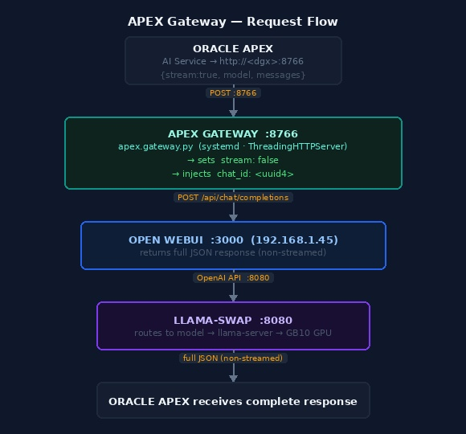

# APEX Gateway Installation Guide
## NVIDIA DGX Spark (GB10)

The APEX Gateway is a lightweight HTTP proxy that adapts Oracle APEX AI requests to the format
expected by Open WebUI. It listens on port 8766, intercepts POST requests, injects `stream: false`
and a `chat_id` UUID, then forwards to the Open WebUI chat completions endpoint.

- **Script:** `/home/sysadmin/codebase/bin/apex.gateway.py`
- **Listen address:** `0.0.0.0:8766`
- **Backend:** `http://192.168.1.45:3000/api/chat/completions` (Open WebUI on this machine)
- **Runtime:** Python 3.13 via Miniforge (`/usr/local/miniforge3`)
- **Service:** `apex-gateway.service` (systemd)

> **Before starting:** Install all required software listed in [`prerequisites.md`](prerequisites.md).

---

## Why This Proxy Exists

Oracle APEX sends streaming requests (`stream: true`) by default and does not include a `chat_id`.
Open WebUI requires `stream: false` for its `/api/chat/completions` endpoint and uses `chat_id` for
conversation tracking. This proxy normalises both fields transparently so APEX can send requests
without modification.

---

## Prerequisites

- Python 3.x available at `/usr/local/miniforge3/bin/python3`
- Open WebUI running on port 3000 and reachable at `192.168.1.45:3000`
- The `sysadmin` user has write access to `/var/log/apex-gateway/`

```bash
# Verify Python
/usr/local/miniforge3/bin/python3 --version   # Python 3.13.x

# Verify Open WebUI is up
curl -o /dev/null -w "%{http_code}" http://192.168.1.45:3000/health
# → 200
```

---

## 1. Install Miniforge (if not present)

Miniforge provides the Python runtime used by this service. If it is already installed at
`/usr/local/miniforge3/`, skip this step.

```bash
# Download Miniforge for ARM64
curl -L https://github.com/conda-forge/miniforge/releases/latest/download/Miniforge3-Linux-aarch64.sh \
     -o /tmp/miniforge.sh

bash /tmp/miniforge.sh -b -p /usr/local/miniforge3
rm /tmp/miniforge.sh
```

No additional Python packages are required — the gateway uses only the standard library
(`http.server`, `socketserver`, `urllib`, `json`, `logging`, `os`, `sys`, `uuid`).

---

## 2. Create the Script Directory

```bash
mkdir -p /home/sysadmin/codebase/bin
```

---

## 3. Write the Gateway Script — `/home/sysadmin/codebase/bin/apex.gateway.py`

```bash
cat > /home/sysadmin/codebase/bin/apex.gateway.py << 'EOF'
#!/usr/bin/env python3
"""Injects stream:false and chat_id into APEX requests before forwarding to Open WebUI."""
import json
import http.server
import socketserver
import urllib.request
import urllib.error
import logging
import os
import sys
import uuid

BACKEND = os.environ.get(
    "APEX_BACKEND",
    "http://192.168.1.45:3000/api/chat/completions"
)

logging.basicConfig(
    level=logging.INFO,
    stream=sys.stdout,
    format="%(asctime)s %(levelname)s %(message)s"
)


class StreamProxy(http.server.BaseHTTPRequestHandler):

    def do_POST(self):
        length = int(self.headers.get("Content-Length", 0))
        raw = self.rfile.read(length)

        try:
            body = json.loads(raw)
            body["stream"] = False
            if "chat_id" not in body:
                body["chat_id"] = str(uuid.uuid4())
            raw = json.dumps(body).encode("utf-8")
            logging.info("model=%s chat_id=%s stream=false",
                         body.get("model", "unknown"), body["chat_id"])
        except ValueError:
            logging.warning("Non-JSON body, forwarding as-is")

        req = urllib.request.Request(BACKEND, data=raw, method="POST")
        for k, v in self.headers.items():
            if k.lower() in ("host", "content-length", "transfer-encoding"):
                continue
            req.add_header(k, v)
        req.add_header("Content-Length", str(len(raw)))
        req.add_header("Content-Type", "application/json")

        try:
            with urllib.request.urlopen(req, timeout=120) as resp:
                data = resp.read()
                self.send_response(resp.status)
                for k, v in resp.headers.items():
                    if k.lower() == "transfer-encoding":
                        continue
                    self.send_header(k, v)
                self.end_headers()
                self.wfile.write(data)
        except urllib.error.HTTPError as e:
            data = e.read()
            self.send_response(e.code)
            for k, v in e.headers.items():
                if k.lower() == "transfer-encoding":
                    continue
                self.send_header(k, v)
            self.end_headers()
            self.wfile.write(data)
        except urllib.error.URLError as e:
            logging.error("Backend unreachable: %s", e.reason)
            self.send_response(503)
            self.send_header("Content-Type", "application/json")
            self.end_headers()
            self.wfile.write(json.dumps(
                {"error": "backend unavailable", "detail": str(e.reason)}
            ).encode())

    def log_message(self, fmt, *args):
        pass  # suppress default access log; structured logging used instead


class ThreadingHTTPServer(socketserver.ThreadingMixIn, http.server.HTTPServer):
    daemon_threads = True


if __name__ == "__main__":
    server = ThreadingHTTPServer(("0.0.0.0", 8766), StreamProxy)
    logging.info("Listening on 0.0.0.0:8766 → %s", BACKEND)
    server.serve_forever()
EOF

chmod 644 /home/sysadmin/codebase/bin/apex.gateway.py
```

---

## 4. Create the Log Directory

```bash
sudo mkdir -p /var/log/apex-gateway
sudo chown sysadmin:sysadmin /var/log/apex-gateway
```

---

## 5. Systemd Unit — `/etc/systemd/system/apex-gateway.service`

The `APEX_BACKEND` environment variable controls where requests are forwarded. Set it to the
Open WebUI host and port that APEX should talk to.

```bash
sudo tee /etc/systemd/system/apex-gateway.service > /dev/null << 'EOF'
[Unit]
Description=APEX Gateway Proxy
After=network-online.target
Wants=network-online.target

[Service]
Type=simple
User=sysadmin
Group=sysadmin

Environment=APEX_BACKEND=http://192.168.1.45:3000/api/chat/completions
ExecStart=/usr/local/miniforge3/bin/python3 /home/sysadmin/codebase/bin/apex.gateway.py

Restart=on-failure
RestartSec=5s
KillSignal=SIGTERM
TimeoutStopSec=30s

LogsDirectory=apex-gateway
StandardOutput=append:/var/log/apex-gateway/apex-gateway.log
StandardError=append:/var/log/apex-gateway/apex-gateway.log

[Install]
WantedBy=multi-user.target
EOF
```

Enable and start:

```bash
sudo systemctl daemon-reload
sudo systemctl enable apex-gateway.service
sudo systemctl start apex-gateway.service
sudo systemctl status apex-gateway.service
```

---

## 6. Verify

```bash
# Service is running
sudo systemctl is-active apex-gateway.service
# → active

# Gateway is listening on port 8766
ss -tlnp | grep 8766

# Test a proxied request (replace with a real API key if Open WebUI requires auth)
curl -s -X POST http://localhost:8766 \
  -H "Content-Type: application/json" \
  -H "Authorization: Bearer <your-openwebui-api-key>" \
  -d '{"model":"gpt-oss-120b","messages":[{"role":"user","content":"ping"}]}' | \
  python3 -m json.tool | head -10

# Check logs
tail -f /var/log/apex-gateway/apex-gateway.log
```

A successful log entry looks like:

```
2026-06-23 18:30:55,123 INFO Listening on 0.0.0.0:8766 → http://192.168.1.45:3000/api/chat/completions
2026-06-23 18:31:02,456 INFO model=gpt-oss-120b chat_id=a1b2c3d4-... stream=false
```

---

## 7. Configure Oracle APEX

In Oracle APEX AI Attributes, set the AI service endpoint to:

```
http://<dgx-spark-ip>:8766
```

Use any non-empty string as the API key (the gateway forwards the `Authorization` header to
Open WebUI unchanged). Set the model name to match one of the model IDs registered in
llama-swap (e.g., `gpt-oss-120b`).

---

## 8. Changing the Backend URL

If the Open WebUI IP or port changes, update the `APEX_BACKEND` environment variable in the
service file and reload:

```bash
sudo sed -i 's|APEX_BACKEND=.*|APEX_BACKEND=http://NEW_IP:3000/api/chat/completions|' \
    /etc/systemd/system/apex-gateway.service

sudo systemctl daemon-reload
sudo systemctl restart apex-gateway.service
```

---

## 9. Service Manager Script

`/home/sysadmin/codebase/bin/init.apex-gateway` manages the service:

```bash
init.apex-gateway start
init.apex-gateway stop
init.apex-gateway restart
init.apex-gateway reload    # daemon-reload then restart
init.apex-gateway status
```

---

## How It Works

[](images/apex-gateway-flow.jpg)

```
Oracle APEX
    │  POST http://<dgx>:8766
    │  {stream: true, model: "...", messages: [...]}
    ▼
apex.gateway.py  (port 8766)
    │  Injects: stream=false, chat_id=<uuid>
    │  Forwards to APEX_BACKEND
    ▼
Open WebUI  (port 3000)
    │  POST /api/chat/completions
    │  Returns full JSON response (not streamed)
    ▼
apex.gateway.py
    │  Relays response back verbatim
    ▼
Oracle APEX  (receives complete response)
```

The `ThreadingHTTPServer` handles concurrent APEX requests in separate threads.
The `timeout=120` on `urlopen` allows up to 2 minutes for large model responses.

---

## Key Paths

| Path | Purpose |
|---|---|
| `/home/sysadmin/codebase/bin/apex.gateway.py` | Gateway script |
| `/home/sysadmin/codebase/bin/init.apex-gateway` | Service manager helper |
| `/etc/systemd/system/apex-gateway.service` | Systemd unit |
| `/var/log/apex-gateway/apex-gateway.log` | Log file |
| `/usr/local/miniforge3/bin/python3` | Python runtime (3.13) |
