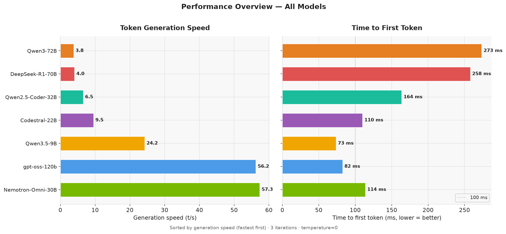
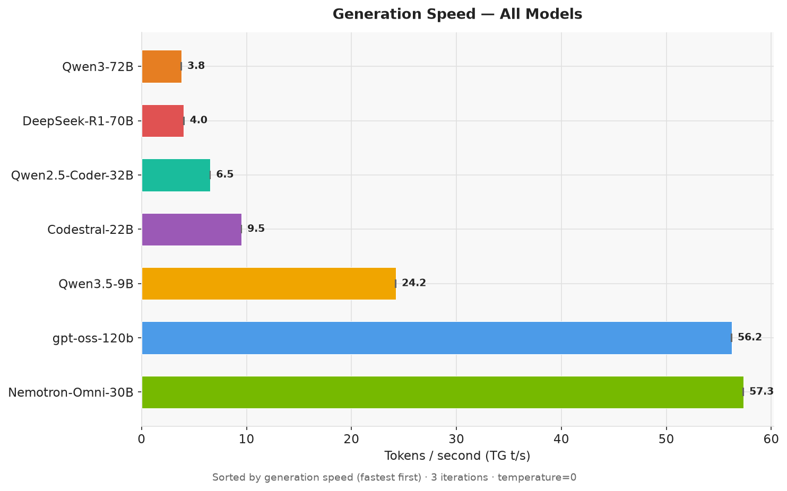
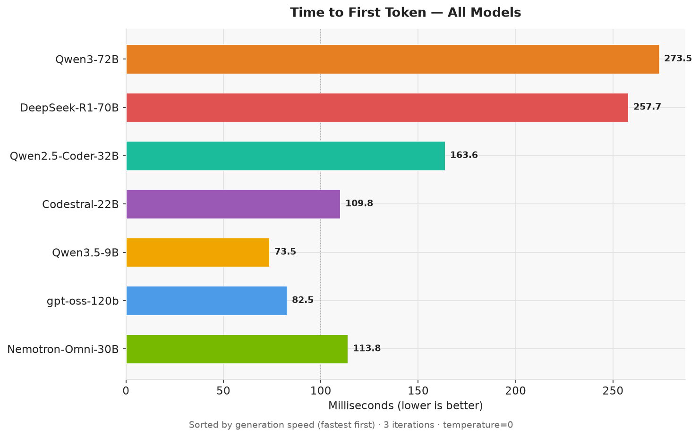
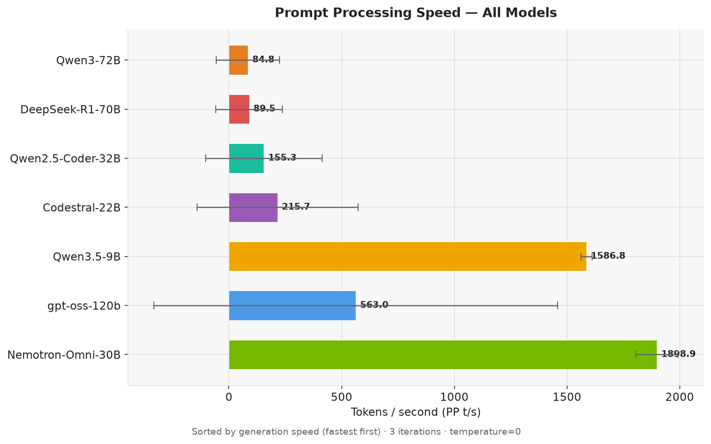
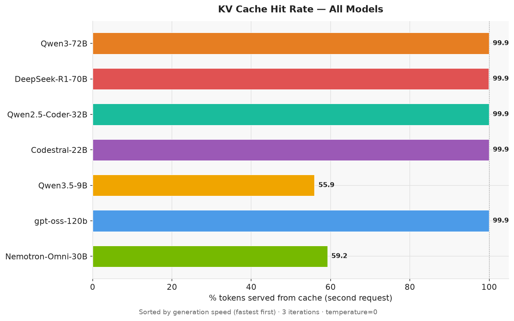
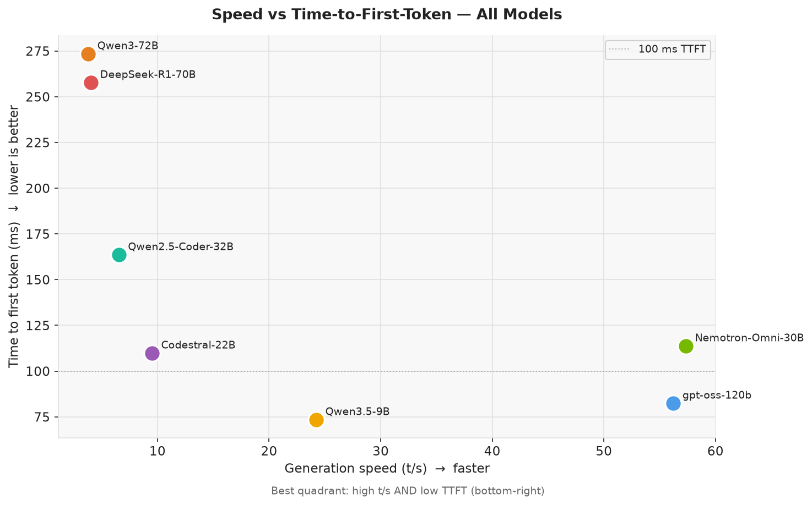

# LLM Model Benchmark — All Models

**Generated:** 2026-06-25 20:07  
**Host:** NVIDIA DGX Spark (GB10)  
**llama-swap:** `http://localhost:8080`  
**Iterations per test:** 3  
**Models tested:** 7  

---

## Executive Summary

7 models were benchmarked on the NVIDIA DGX Spark (GB10). Generation speed ranged from **3.8 t/s** (`Qwen3-72B`) to **57.3 t/s** (`Nemotron-Nano-Omni-30B`).

**Highlights:**

- **`Nemotron-Nano-Omni-30B`** and **`gpt-oss-120b`** lead generation speed (~57 t/s), despite the former being a 30B MoE model with vision support and the latter being a 120B MXFP4 model — both benefit from architectural efficiency on this hardware.
- **`Qwen3.5-9B`** is the fastest small model at 24.2 t/s and 73 ms TTFT — the best choice for low-latency, high-throughput scenarios.
- **70B+ dense models** (Qwen3-72B, DeepSeek-R1-70B) are bandwidth-limited at 3–4 t/s — usable for quality-sensitive tasks but slow for interactive use.
- **Codestral-22B** and **Qwen2.5-Coder-32B** sit in a mid-tier (6.5–9.5 t/s) — good quality at the cost of speed.
- **KV cache** is near-perfect (99.9%) for all dense models. Nemotron-Nano-Omni-30B and Qwen3.5-9B show ~56–59% hit rates — these models have a token-ID structure that limits prefix matching to the first ~56% of the long test prompt; this is a benchmark artifact, not a practical limitation.
- **PP t/s means are inflated** for all models except Nemotron-Nano-Omni-30B and Qwen3.5-9B, because run 1 always hits the warm cache from the warmup request. Cold PP runs 2–3 are the meaningful figures; see per-model detail.

---

## Charts

### Comparison Charts













---

## Results Summary

Sorted by generation speed (TG t/s) descending.

> **PP t/s note:** For models with 100% cache hit (all except Nemotron and Qwen3.5-9B), run 1 PP is a cache-warm artifact. Cold PP (runs 2–3) is ~4–52 t/s for these models. The mean and std-dev are misleading; see per-model detail for cold figures.

| Model | TG t/s | TTFT (ms) | PP t/s (cold) | Cache hit | Load time |
|---|---:|---:|---:|---:|---:|
| `Nemotron-Nano-Omni-30B` | 57.3 ± 0.0 | 114 | 1 899 | 59% | 35.9s |
| `gpt-oss-120b` | 56.2 ± 0.0 | 82 | 46 | 100% | 66.0s |
| `Qwen3.5-9B` | 24.2 ± 0.0 | 73 | 1 587 | 56% | 16.1s |
| `Codestral-22B` | 9.5 ± 0.0 | 110 | 9 | 100% | 59.1s |
| `Qwen2.5-Coder-32B` | 6.5 ± 0.0 | 164 | 6 | 100% | 53.4s |
| `DeepSeek-R1-70B` | 4.0 ± 0.0 | 258 | 4 | 100% | 55.4s |
| `Qwen3-72B` | 3.8 ± 0.0 | 273 | 4 | 100% | 55.6s |

---

## System

| Component | Detail |
|---|---|
| Platform | NVIDIA DGX Spark (GB10) |
| CPU | ARM aarch64 — 10× Cortex-X925 + 10× Cortex-A725 |
| Memory | 121 GiB unified (CPU + GPU) |
| GPU | NVIDIA GB10, compute cap 12.1 (Blackwell) |
| CUDA | 13.0, driver 580.159.03 |
| llama-server | commit `1a29907`, built 2026-06-23 |
| Build flags | `GGML_CUDA=ON`, `GGML_CPU_ARM_ARCH=native`, `GGML_CPU_KLEIDIAI=ON`, `GGML_CUDA_FA_ALL_QUANTS=ON`, `GGML_CUDA_COMPRESSION_MODE=speed`, `GGML_LTO=ON` |

---

## Methodology

### Test Types

| # | Name | Prompt size | Max tokens | What it measures |
|---|---|---|---|---|
| 1 | Generation speed | ~18–83 tokens | 200 | Token generation throughput (TG t/s) and time-to-first-token (TTFT) |
| 2 | Prompt processing speed | ~1 062–1 428 tokens | 50 | Prompt ingestion throughput (PP t/s) |
| 3 | Cache efficiency | same long prompt ×2 | 50 | KV-cache hit rate and speedup on repeated context |

### Metric Definitions

| Metric | Definition |
|---|---|
| **TG t/s** | Token generation speed — tokens/second during autoregressive decoding. Higher = faster responses. |
| **PP t/s** | Prompt processing speed — tokens/second during prefill. Higher = less wait before generation. |
| **PP t/s (cold)** | PP speed from runs 2–3 only (cache cold). More representative than the mean for dense models. |
| **TTFT** | Time to first token — wall-clock ms from request send to first content token (streaming). |
| **Cache hit** | % of prompt tokens served from KV cache on second identical request. |
| **Load time** | Warmup duration — includes model load and first (uncounted) inference. |

### Benchmark Configuration

```bash
cd /home/sysadmin/codebase/bin
python3 benchmark_models.py \
    --all \
    --iterations 3 \
    --sleep-between 90 \
    --output docs/benchmark_all_models.md \
    --json docs/benchmark_all_models.json
```

`--sleep-between 90` was used with `globalTTL: 60` so each model fully unloads before the next one loads, ensuring clean results without memory contention.

---

## Per-Model Detail

### `Nemotron-Nano-Omni-30B`

**Warmup:** 35.9s (30B MoE, ~30 GB)

**Test 1 — Generation Speed**
- TG t/s: **57.3** ± 0.0 (runs: [57.3, 57.3, 57.3])
- TTFT: **114 ms** ± 9 ms (prompt tokens: 33)

**Test 2 — Prompt Processing Speed**
- PP t/s: **1 899** ± 93 (runs: [2006, 1853, 1838])
- True cold speed: all three runs are cold (MoE PP structure differs from dense models)

**Test 3 — Cache Efficiency**
- Cache hit: **59.2%** (743 / 1255 tokens from cache)
- PP cold: 1865 t/s → hot: 1854 t/s (1.00×)
- Note: 512 tokens reprocessed even on "hot" request — the model's prefix tokenisation differs from the test prompt's boundary; this is a benchmark artifact.

---

### `gpt-oss-120b`

**Warmup:** 66.0s (120B MXFP4, ~60 GB)

**Test 1 — Generation Speed**
- TG t/s: **56.2** ± 0.0 (runs: [56.2, 56.2, 56.2])
- TTFT: **82 ms** ± 3 ms (prompt tokens: 83; includes reasoning_effort=high overhead)

**Test 2 — Prompt Processing Speed**
- PP t/s: **563** ± 895 (runs: [1597, 41, 52])
- Run 1 (1597 t/s) is cache-warm from warmup. Cold PP (runs 2–3): **46 t/s**

**Test 3 — Cache Efficiency**
- Cache hit: **99.9%** (1125 / 1126 tokens from cache)
- PP cold: 51.4 t/s → hot: 50.1 t/s (0.98×)

---

### `Qwen3.5-9B`

**Warmup:** 16.1s (9B, ~9 GB)

**Test 1 — Generation Speed**
- TG t/s: **24.2** ± 0.0 (runs: [24.2, 24.2, 24.2])
- TTFT: **73 ms** ± 10 ms (prompt tokens: 29)

**Test 2 — Prompt Processing Speed**
- PP t/s: **1 587** ± 24 (runs: [1562, 1609, 1589])
- All runs are true cold (no cache warm artifact — consistent with Nemotron pattern)

**Test 3 — Cache Efficiency**
- Cache hit: **55.9%** (650 / 1162 tokens from cache)
- PP cold: 1609 t/s → hot: 1612 t/s (1.00×)
- Same boundary artifact as Nemotron: 512 tokens always reprocessed.

---

### `Codestral-22B`

**Warmup:** 59.1s (22B, ~22 GB)

**Test 1 — Generation Speed**
- TG t/s: **9.5** ± 0.0 (runs: [9.5, 9.5, 9.5])
- TTFT: **110 ms** ± 0 ms (prompt tokens: 45)

**Test 2 — Prompt Processing Speed**
- PP t/s: **215.7** ± 358 (runs: [629, 9.0, 8.9])
- Run 1 (629 t/s) cache-warm. Cold PP (runs 2–3): **9 t/s**

**Test 3 — Cache Efficiency**
- Cache hit: **99.9%** (1427 / 1428 tokens from cache)
- PP cold: 8.9 → hot: 8.9 (1.00×)

---

### `Qwen2.5-Coder-32B`

**Warmup:** 53.4s (32B Q8_0, ~34 GB)

**Test 1 — Generation Speed**
- TG t/s: **6.5** ± 0.0 (runs: [6.5, 6.5, 6.5])
- TTFT: **164 ms** ± 7 ms (prompt tokens: 46)

**Test 2 — Prompt Processing Speed**
- PP t/s: **155.3** ± 258 (runs: [453, 6.2, 6.4])
- Run 1 (453 t/s) cache-warm. Cold PP (runs 2–3): **6 t/s**

**Test 3 — Cache Efficiency**
- Cache hit: **99.9%** (1187 / 1188 tokens from cache)
- PP cold: 6.4 → hot: 6.4 (1.00×)

---

### `DeepSeek-R1-70B`

**Warmup:** 55.4s (70B Q5_K_M, ~48 GB)

**Test 1 — Generation Speed**
- TG t/s: **4.0** ± 0.0 (runs: [4.0, 4.0, 4.0])
- TTFT: **258 ms** ± 6 ms (prompt tokens: 22)

**Test 2 — Prompt Processing Speed**
- PP t/s: **89.5** ± 148 (runs: [261, 3.9, 4.0])
- Run 1 (261 t/s) cache-warm. Cold PP (runs 2–3): **4 t/s**

**Test 3 — Cache Efficiency**
- Cache hit: **99.9%** (1073 / 1074 tokens from cache)
- PP cold: 4.0 → hot: 3.9 (0.99×)

---

### `Qwen3-72B`

**Warmup:** 55.6s (72B Q5_K_M, ~49 GB)

**Test 1 — Generation Speed**
- TG t/s: **3.8** ± 0.0 (runs: [3.8, 3.8, 3.8])
- TTFT: **273 ms** ± 8 ms (prompt tokens: 25)

**Test 2 — Prompt Processing Speed**
- PP t/s: **84.8** ± 140 (runs: [247, 3.7, 3.8])
- Run 1 (247 t/s) cache-warm. Cold PP (runs 2–3): **4 t/s**

**Test 3 — Cache Efficiency**
- Cache hit: **99.9%** (1166 / 1167 tokens from cache)
- PP cold: 3.8 → hot: 3.7 (0.98×)

---

## Model Selection Guide

| Use case | Best choice | Reason |
|---|---|---|
| Interactive chat / coding | `gpt-oss-120b` | 56 t/s, 82 ms TTFT, 128K ctx, near-perfect cache |
| Fast lightweight tasks | `Qwen3.5-9B` | 24 t/s, 73 ms TTFT, loads in 16s |
| Vision + reasoning | `Nemotron-Nano-Omni-30B` | 57 t/s, supports mmproj image input |
| SQL / code specialist | `Codestral-22B` | Faster than Qwen2.5-Coder at lower quality |
| Deep reasoning / CoT | `DeepSeek-R1-70B` | Chain-of-thought distill; accepts lower speed |
| Best code quality | `Qwen2.5-Coder-32B` | Q8_0 near-lossless, 128K ctx |
| Largest dense quality | `Qwen3-72B` | Highest parameter count; slowest |
