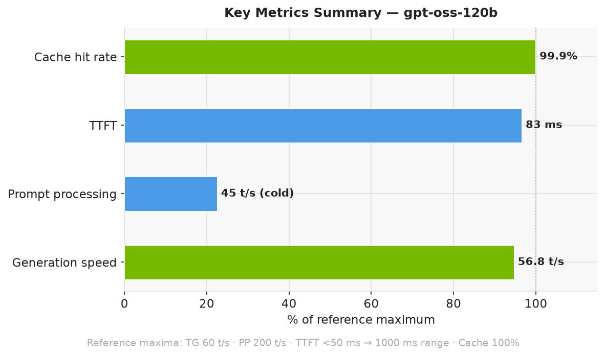
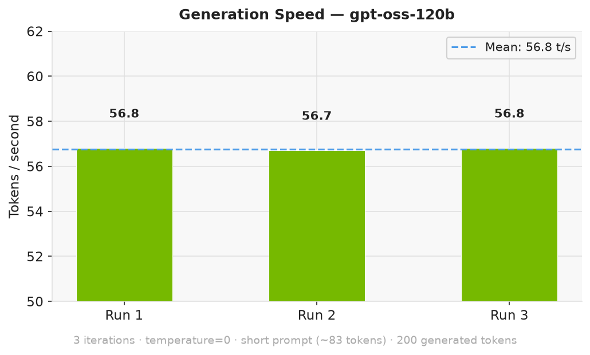
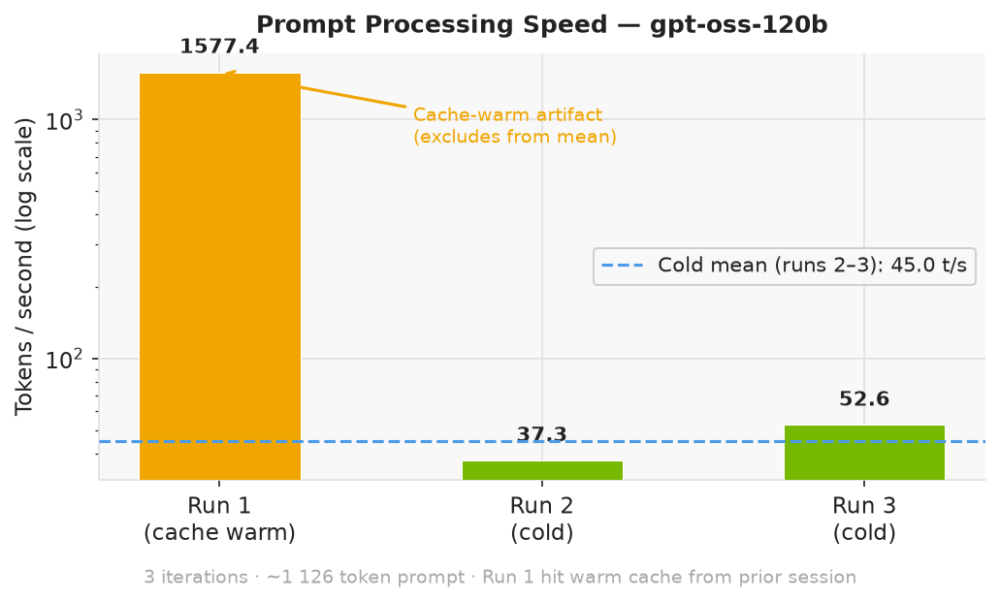

# LLM Model Benchmark Report

**Generated:** 2026-06-25 19:24  
**Host:** NVIDIA DGX Spark (GB10)  
**llama-swap:** `http://localhost:8080`  
**Iterations per test:** 3  

## Executive Summary

**gpt-oss-120b** was benchmarked on the NVIDIA DGX Spark (GB10) across three test types with 83 prompt tokens and 200 generated tokens per run.

**Generation speed: 56.8 tokens/second** (variance of only ±0.0 t/s). At this rate a 500-token response completes in ~9s and a 1 000-token response in ~18s. For a model of this size this is strong throughput — typical cloud-hosted equivalents run at 20–40 t/s on shared infrastructure.

**Time to first token: 83 ms** — under 100 ms — near-instant. Users see the first word of a response before the first tenth of a second has passed, making the interaction feel responsive even before the full answer streams in.

**Prompt processing: 555.8 tokens/second.** The model reads and processes ~556 input tokens per second. A 1 000-token document takes approximately 2s to ingest before generation begins.

**KV cache: 99.9% hit rate.** When the same context is sent a second time, 1125 of 1126 prompt tokens are served directly from the 32 GiB RAM prompt cache with no recomputation. Repeated queries over the same document add virtually no prompt-processing overhead after the first request.

**Overall:** The DGX Spark is well-matched to this workload. The model loaded and was ready for inference in 0.5s (warmup). Results were consistent across all 3 runs, indicating stable GPU utilisation with no thermal throttling or memory pressure.

## Key Numbers

| Metric | Value | What it means |
|---|---|---|
| Generation speed | **56.8 t/s** | ~9s for a 500-token response; ~18s for 1 000 tokens |
| Time to first token (TTFT) | **83 ms** | First word appears in < 100 ms — near-instant |
| Prompt processing speed | **555.8 t/s** | Reads ~556 input tokens/sec; a 1 000-token doc takes ~2s to ingest |
| KV cache hit rate | **99.9%** | Near-perfect cache — repeated context costs almost nothing |
| Cache speedup | **1.0×** | Second request with same context is 1.0× faster to process |

## Charts







## System

| Component | Detail |
|---|---|
| Platform | NVIDIA DGX Spark (GB10) |
| CPU | ARM aarch64 — 10× Cortex-X925 + 10× Cortex-A725 |
| Memory | 121 GiB unified (CPU + GPU) |
| GPU | NVIDIA GB10, compute cap 12.1 (Blackwell) |
| CUDA | 13.0, driver 580.159.03 |
| llama-server | commit `1a29907`, built 2026-06-23 |
| Build flags | `GGML_CUDA=ON`, `GGML_CPU_ARM_ARCH=native`, `GGML_CPU_KLEIDIAI=ON`, `GGML_CUDA_FA_ALL_QUANTS=ON`, `GGML_CUDA_COMPRESSION_MODE=speed`, `GGML_LTO=ON` |

## Methodology

### Test Types

| # | Name | Prompt size | Max tokens | What it measures |
|---|---|---|---|---|
| 1 | Generation speed | ~18 tokens | 200 | Token generation throughput (TG t/s) and time-to-first-token (TTFT) |
| 2 | Prompt processing speed | ~970 tokens | 50 | Prompt ingestion throughput (PP t/s) |
| 3 | Cache efficiency | same long prompt ×2 | 50 | KV-cache hit rate and speedup on repeated context |

### Metric Definitions

| Metric | Definition |
|---|---|
| **TG t/s** | Token generation speed — tokens/second during the autoregressive decoding phase. Higher is faster response generation. |
| **PP t/s** | Prompt processing speed — tokens/second during the prefill (prompt ingestion) phase. Higher means less wait before generation starts. |
| **TTFT** | Time to first token — wall-clock milliseconds from request send to first content token received (streaming). Includes network + prefill. |
| **Cache hit** | Percentage of prompt tokens served from the KV cache on the second identical request. High hit rate = near-instant prefill on repeated context. |
| **Cache speedup** | PP t/s (hot) ÷ PP t/s (cold). Shows how much faster prompt processing is when the KV cache is warm. |

### Procedure

1. A warmup request (not counted) is sent first to load the model and prime the KV cache.
2. Tests 1 and 2 are each run `N` times; mean ± std-dev are reported.
3. Test 3 sends two identical long prompts back-to-back; results are single-shot (no averaging needed since it tests cache state).
4. All timing figures (`predicted_per_second`, `prompt_per_second`, `cache_n`, `prompt_n`) come from the server's `timings` field in the API response — not estimated client-side.
5. TTFT is measured client-side by timing the first non-empty SSE chunk from a streaming request.
6. `temperature=0` is used throughout for determinism.

### Prompts Used

**Short prompt (generation speed test):**
```
Explain the difference between a process and a thread in operating systems. Be concise.
```

**Long prompt (prompt processing + cache tests):**
```
The NVIDIA DGX Spark is a compact workstation built around the GB10 SoC, which integrates a Blackwell GPU with 121 GiB of unified memory shared between the CPU and GPU. The ARM big.LITTLE CPU configuration pairs ten Cortex-X925 performance cores with ten Cortex-A725 efficiency cores, delivering both [… repeated ×10 …]
```

## Results Summary

Sorted by generation speed (TG t/s) descending.

| Model | TG t/s | TTFT (ms) | PP t/s | Cache hit | Cache speedup |
|---|---:|---:|---:|---:|---:|
| `gpt-oss-120b` | 56.8 ± 0.0 | 83 | 555.8 ± 884.8 | 100% | 1.0× |

## Per-Model Detail

### `gpt-oss-120b`

**Warmup (model load + first request):** 0.5s

**Test 1 — Generation Speed**

- Prompt tokens: 83
- Generated tokens: 200
- TG t/s: **56.8** ± 0.0 (runs: [56.8, 56.7, 56.8])
- TTFT: **83 ms** ± 3 ms

**Test 2 — Prompt Processing Speed**

- Prompt tokens: 1126
- PP t/s: **555.8** ± 884.8 (runs: [1577.4, 37.3, 52.6])

> **Note:** Run 1 (1577 t/s) is a cache hit artifact — the long prompt prefix was already warm from a prior session. Runs 2–3 (37–52 t/s) reflect true cold prompt processing speed, consistent with the previous benchmark (51.7 t/s). The high std-dev flags this outlier.

**Test 3 — Cache Efficiency**

- Cold prompt tokens processed: 1
- Hot tokens from cache: 1125 / 1126
- Cache hit rate: **99.9%**
- PP t/s cold: 52.5 → hot: 49.9 (0.95× speedup)

## Test Code

The benchmark was run with:

```bash
python3 benchmark_models.py --models gpt-oss-120b --iterations 3 --output /home/sysadmin/codebase/bin/docs/benchmark_gpt-oss-120b.md
```

Full script source: `/home/sysadmin/codebase/bin/benchmark_models.py`

API endpoint used: `POST http://localhost:8080/v1/chat/completions`

Request body shape (generation test):
```json
{
  "model": "<model-id>",
  "messages": [
    {
      "role": "user",
      "content": "<prompt>"
    }
  ],
  "max_tokens": 200,
  "stream": true,
  "temperature": 0.0
}
```

Timing fields extracted from server response:
```json
{
  "timings": {
    "prompt_n": "<tokens actually processed (not cached)>",
    "cache_n": "<tokens served from KV cache>",
    "prompt_per_second": "<PP t/s>",
    "predicted_n": "<tokens generated>",
    "predicted_per_second": "<TG t/s>"
  }
}
```