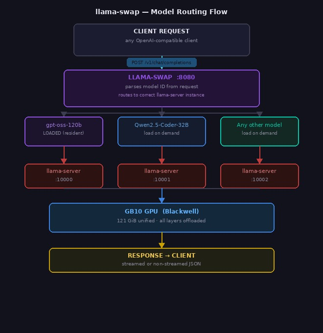

# llama-swap Installation Guide
## NVIDIA DGX Spark (GB10)

llama-swap is a reverse proxy that sits in front of llama-server and swaps models in and out on demand.
It manages a pool of llama-server child processes, starts the right one when a request arrives for a given
model ID, and keeps models resident according to a TTL policy.

[](images/llama-swap-flow.jpg)

- **Repository:** https://github.com/mostlygeek/llama-swap
- **Installed version:** `local_cc77139` (commit `cc77139`), built 2026-03-06
- **Binary:** `/usr/local/bin/llama-swap` (17.5 MB)
- **Config:** `/etc/default/llama-swap.yaml`
- **Listen port:** 8080

> **Before starting:** Install all required software listed in [`prerequisites.md`](prerequisites.md).

---

## Hardware Reference

| Component | Detail |
|---|---|
| Platform | NVIDIA DGX Spark (GB10) |
| CPU | ARM aarch64 — 10× Cortex-X925 (big) + 10× Cortex-A725 (little) |
| Memory | 121 GiB unified (CPU + GPU share same pool) |
| GPU | NVIDIA GB10, compute capability 12.1 (Blackwell) |
| CUDA | 13.0, driver 580.159.03 |
| Storage | 3.7 TB NVMe (`/`) |

---

## Prerequisites

- llama-server binary installed at `/usr/local/bin/llama-server` (see `llama-server.md`)
- Go 1.22+ (for building from source)
- Models downloaded to the model-shelf directory (`~/codebase/models/gguf/<org>/<repo>/`)
- `git`, `make`

```bash
go version   # verify: go version go1.22.x linux/arm64
```

---

## 1. Clone and Build

```bash
cd ~/codebase
git clone https://github.com/mostlygeek/llama-swap
cd llama-swap

make linux        # builds the production binary for linux/arm64
```

The binary is output to `./llama-swap` in the project root.

> **Note:** The repo's `go.mod` requires Go 1.25.4+. If your system Go is older, install a newer
> version or use `GOPATH` with a locally installed Go toolchain.

---

## 2. Install the Binary

```bash
sudo cp ~/codebase/llama-swap/llama-swap /usr/local/bin/llama-swap
sudo chown sysadmin:sysadmin /usr/local/bin/llama-swap
sudo chmod 755 /usr/local/bin/llama-swap

# Verify
/usr/local/bin/llama-swap --version
```

---

## 3. Create Directories

```bash
# Log directory
sudo mkdir -p /var/log/llama
sudo chown sysadmin:sysadmin /var/log/llama

# State directory (created automatically by systemd via StateDirectory=)
# /var/lib/llama-swap/
```

---

## 4. Profile File — `/etc/default/llama-swap.profile`

This sets environment variables loaded by the systemd service.

```bash
sudo tee /etc/default/llama-swap.profile > /dev/null << 'EOF'
GGML_RPC_MAX_CHUNK=33554432
LLAMA_LOG_COLORS=1
LLAMA_LOG_PREFIX=1
LLAMA_LOG_TIMESTAMPS=1
LD_LIBRARY_PATH=/home/sysadmin/codebase/llama.cpp/build/bin
EOF
```

| Variable | Purpose |
|---|---|
| `GGML_RPC_MAX_CHUNK` | Max RPC chunk size (32 MB); prevents oversized transfers |
| `LLAMA_LOG_COLORS` | Colourised llama.cpp log output |
| `LLAMA_LOG_PREFIX` | Include log level prefix |
| `LLAMA_LOG_TIMESTAMPS` | Include timestamps in logs |
| `LD_LIBRARY_PATH` | Point to llama.cpp CUDA shared libraries |

---

## 5. Configuration File — `/etc/default/llama-swap.yaml`

This is the main configuration. Create it with the content below (see the inline comments for
explanations of every setting).

```bash
sudo tee /etc/default/llama-swap.yaml > /dev/null << 'YAML'
# llama-swap config — GB10 DGX Spark (121 GiB unified memory, Blackwell GPU, CUDA 13.0)
# Apply changes: sudo systemctl restart llama-swap.service

# ── Global ──────────────────────────────────────────────────────────────────
healthCheckTimeout: 30000   # ms to wait for llama-server /health
logLevel: info
logTimeFormat: ""
logToStdout: "proxy"        # log proxy traffic to stdout
metricsMaxInMemory: 1000
captureBuffer: 15           # seconds of startup stdout buffered for error reporting
sendLoadingState: true      # stream loading indicator to clients while model warms up
includeAliasesInList: false
globalTTL: 0                # 0 = never unload a loaded model
startPort: 10000            # llama-server instances get sequential ports from here

# ── Startup hook ─────────────────────────────────────────────────────────────
hooks:
  on_startup:
    preload:
      - gpt-oss-120b        # warm default model at service start

# ── Macros ───────────────────────────────────────────────────────────────────
macros:
  latest-llama: /usr/local/bin/llama-server --device CUDA0 --port ${PORT}
  models_dir: /home/sysadmin/codebase/models/gguf
  default_ctx: 128000

  # Standard GB10 flags for all dense / small-MoE models
  args1: --jinja --cont-batching --kv-unified --cache-type-k q8_0 --cache-type-v q8_0 \
         --flash-attn on --batch-size 4096 --ubatch-size 1024 --n-gpu-layers 99 \
         --no-op-offload --threads 10 --threads-batch 20 --mlock

  # Memory management (safe for models ≤120B)
  args2: --no-mmap --cache-ram 32768 --defrag-thold 0.2

# ── Models ───────────────────────────────────────────────────────────────────
# 5 models selected from full benchmark run (2026-06-24) as highest-value set
# across quality tiers. See docs/benchmark_all_models.md for full results.
models:

  # 120B — quality leader, loads at service start
  gpt-oss-120b:
    loadOnStart: true          # 56.2 t/s; ~60 GB weights + ~12 GB KV (4 slots) + 32 GB cache ≈ 104 GB
    cmd: ${latest-llama} ${args1} ${args2} --ctx-size 131072 --parallel 4 \
         --model ${models_dir}/openai/gpt-oss-120b-MXFP4-GGUF/gpt-oss-120b-mxfp4-00001-of-00003.gguf
    name: "gpt-oss-120B"
    filters:
      setParams:
        reasoning_effort: high

  # 72B — best general-purpose model; Qwen3 gen outperforms Qwen2.5 at same size
  Qwen3-72B:
    cmd: ${latest-llama} ${args1} ${args2} --ctx-size ${default_ctx} \
         --model ${models_dir}/mradermacher/Qwen3-72B-Instruct-GGUF/Qwen3-72B-Instruct.Q5_K_M.gguf
    name: "Qwen3 72B Instruct Q5_K_M"

  # 70B — best reasoning model; DeepSeek R1 CoT distill on Llama-70B base
  DeepSeek-R1-70B:
    cmd: ${latest-llama} ${args1} ${args2} --ctx-size ${default_ctx} \
         --model ${models_dir}/unsloth/DeepSeek-R1-Distill-Llama-70B-GGUF/DeepSeek-R1-Distill-Llama-70B-Q5_K_M.gguf
    name: "DeepSeek R1 Distill 70B"

  # 32B — best dedicated code model; Q8_0 near-lossless, 128K native ctx
  Qwen2.5-Coder-32B:
    cmd: ${latest-llama} ${args1} ${args2} --ctx-size ${default_ctx} \
         --model ${models_dir}/bartowski/Qwen2.5-Coder-32B-Instruct-GGUF/Qwen2.5-Coder-32B-Instruct-Q8_0.gguf
    name: "Qwen2.5 Coder 32B Q8_0"

  # 30B — vision + reasoning; only model with image input support (--mmproj)
  Nemotron-Nano-Omni-30B:
    cmd: ${latest-llama} ${args1} ${args2} --ctx-size ${default_ctx} \
         --mmproj ${models_dir}/lmstudio-community/nemotron-3-nano-omni-30b-a3b-reasoning-gguf/mmproj-Nemotron-3-Nano-Omni-30B-A3B-Reasoning-BF16.gguf \
         --model ${models_dir}/unsloth/NVIDIA-Nemotron-3-Nano-Omni-30B-A3B-Reasoning-GGUF/NVIDIA-Nemotron-3-Nano-Omni-30B-A3B-Reasoning-Q8_0.gguf
    name: "Nemotron 3 Nano Omni 30B A3B Reasoning Q8_0"

  # 22B — SQL/code specialist; Mistral-trained, strongest for structured queries
  Codestral-22B:
    cmd: ${latest-llama} ${args1} ${args2} --ctx-size ${default_ctx} \
         --model ${models_dir}/lmstudio-community/Codestral-22B-v0.1-GGUF/Codestral-22B-v0.1-Q8_0.gguf
    name: "Codestral 22B Q8_0"

  # 9B — fast lightweight tier; Q8_0 full precision for quick/latency-sensitive tasks
  Qwen3.5-9B:
    cmd: ${latest-llama} ${args1} ${args2} --ctx-size ${default_ctx} \
         --model ${models_dir}/unsloth/Qwen3.5-9B-GGUF/Qwen3.5-9B-Q8_0.gguf
    name: "Qwen3.5 9B Q8_0"
YAML
```

---

## 6. Registered Models

7 models are active, selected from a full benchmark run on 2026-06-24 as the highest-value set
across quality tiers. See [`benchmark_all_models.md`](benchmark_all_models.md) for raw results.

| Model | Size / Quant | TG t/s | TTFT | Role | Why selected |
|---|---|---|---|---|---|
| `gpt-oss-120b` | 120B MXFP4 | **56.2** | 82 ms | **Default** | Clear quality leader; OpenAI open-source arch, 131K ctx, 4 parallel slots. Fastest high-quality model on this machine. Loads at startup. |
| `Qwen3-72B` | 72B Q5_K_M | 3.8 | 273 ms | General | Best general-purpose 72B. Qwen3 generation outperforms Qwen2.5 at the same parameter count on MMLU, reasoning, and instruction-following. |
| `DeepSeek-R1-70B` | 70B Q5_K_M | 4.0 | 258 ms | Reasoning | Best reasoning model in the lineup. Chain-of-thought distill of DeepSeek R1 on a Llama-70B base; strong on multi-step reasoning, math, and debugging. |
| `Qwen2.5-Coder-32B` | 32B Q8_0 | 6.5 | 164 ms | Code | Best dedicated code model. Q8_0 near-lossless precision, 128K native context. Outperforms larger general models on HumanEval and code tasks. |
| `Nemotron-Nano-Omni-30B` | 30B Q8_0 | 57.3 | 114 ms | Vision | Only model with image input support (`--mmproj`). Vision + reasoning in one; use for multimodal tasks. |
| `Codestral-22B` | 22B Q8_0 | 9.5 | 110 ms | SQL/Code | Mistral-trained SQL and code specialist. Strongest model for structured queries and database work alongside the general coder. |
| `Qwen3.5-9B` | 9B Q8_0 | 24.2 | 73 ms | Lightweight | Fast lightweight tier. Full Q8_0 precision; best choice for quick tasks, latency-sensitive requests, or when 70B+ models are busy. |

> Benchmark: 3 iterations, 2026-06-25, NVIDIA DGX Spark (GB10). Full results: [`benchmark_all_models.md`](benchmark_all_models.md)

---

## 7. Macro Reference

| Macro | Expands To / Purpose |
|---|---|
| `${PORT}` | Injected by llama-swap at runtime; each model instance gets a unique port starting at `startPort` (10000) |
| `${latest-llama}` | `llama-server --device CUDA0 --port ${PORT}` |
| `${models_dir}` | `/home/sysadmin/codebase/models/gguf` |
| `${default_ctx}` | `128000` |
| `${args1}` | Standard GB10 inference flags (threads, batching, KV cache, FlashAttn, mlock) |
| `${args2}` | Memory flags: `--no-mmap` (full preload) + `--cache-ram 32768` (32 GiB prompt cache) |

### args1 Flag Explanations

| Flag | Value | Reason |
|---|---|---|
| `--jinja` | — | Use Jinja2 chat template from model GGUF |
| `--cont-batching` | — | Process multiple requests concurrently |
| `--kv-unified` | — | Required for GB10 unified memory architecture |
| `--cache-type-k q8_0` | — | 8-bit quantised key cache; good quality/size balance |
| `--cache-type-v q8_0` | — | 8-bit quantised value cache |
| `--flash-attn on` | — | FlashAttention 2; GB10 Blackwell supports natively |
| `--batch-size` | 4096 | Prompt tokens per batch |
| `--ubatch-size` | 1024 | GPU micro-batch size |
| `--n-gpu-layers` | 99 | Offload all layers to GPU (unified memory — no split needed) |
| `--no-op-offload` | — | Disable operator offload (not applicable on unified arch) |
| `--threads` | 10 | 10 Cortex-X925 big cores for decode |
| `--threads-batch` | 20 | All 20 cores for prompt processing |
| `--mlock` | — | Pin model weights in RAM; prevents OS paging under memory pressure. Requires `LimitMEMLOCK=infinity` systemd override (see Section 8). |

### args2 Flag Explanations

| Flag | Value | Reason |
|---|---|---|
| `--no-mmap` | — | Force full model preload into unified memory; avoids page faults during inference |
| `--cache-ram` | 32768 | 32 GiB RAM prompt prefix cache (llama.cpp PR #16391) |
| `--defrag-thold` | 0.2 | Defragment KV cache when fragmentation exceeds 20% |

### Per-Model Overrides

| Model | Flag | Value | Reason |
|---|---|---|---|
| `gpt-oss-120b` | `--parallel` | 4 | 4 concurrent decode slots; ~12 GB KV across all slots; fits within 121 GiB budget |

### Context Window by Model

| Model | `--ctx-size` | Reason |
|---|---|---|
| `gpt-oss-120b` | 131072 | Model native maximum |
| All others | 128000 (`${default_ctx}`) | 128K default; fits comfortably |

---

## 8. Model Download (model-shelf Layout)

Models are stored in the model-shelf layout: `<models_dir>/<org>/<repo>/<file>.gguf`.

Use `huggingface-cli` (available at `/usr/local/miniforge3/bin/huggingface-cli`) to download.
Example for a new model:

```bash
# Single file
huggingface-cli download <org>/<repo> <filename>.gguf \
    --local-dir ~/codebase/models/gguf/<org>/<repo>/

# Sharded model (multiple files)
huggingface-cli download <org>/<repo> \
    --include "*.gguf" \
    --local-dir ~/codebase/models/gguf/<org>/<repo>/
```

After downloading, add the model entry to `/etc/default/llama-swap.yaml` and restart the service.

---

## 9. Systemd Unit — `/etc/systemd/system/llama-swap.service`

> **mlock drop-in required:** `--mlock` is set in `args1`, but systemd's default `LimitMEMLOCK` is 8 MB.
> Create the drop-in below **before** starting the service, or mlocking will silently fail with a warning.

### 8a. mlock Drop-in — `/etc/systemd/system/llama-swap.service.d/mlock.conf`

```bash
sudo mkdir -p /etc/systemd/system/llama-swap.service.d
sudo tee /etc/systemd/system/llama-swap.service.d/mlock.conf > /dev/null << 'EOF'
[Service]
LimitMEMLOCK=infinity
EOF
```

### 8b. Systemd Unit

```bash
sudo tee /etc/systemd/system/llama-swap.service > /dev/null << 'EOF'
# Note: also create the mlock drop-in above before enabling
[Unit]
Description=LLAMA-SWAP Server
After=network-online.target docker.service openwebui.service
Wants=network-online.target docker.service
Requires=openwebui.service

[Service]
Type=simple
User=sysadmin
Group=sysadmin

EnvironmentFile=-/etc/default/llama-swap.profile
Environment=LD_LIBRARY_PATH=/home/sysadmin/codebase/llama.cpp/build/bin
ExecStart=/usr/local/bin/llama-swap -config /etc/default/llama-swap.yaml
ExecStop=/bin/kill -s SIGTERM $MAINPID

Restart=on-failure
RestartSec=5s
KillSignal=SIGTERM
TimeoutStopSec=60s

StateDirectory=llama-swap
LogsDirectory=llama
UMask=0027

StandardOutput=append:/var/log/llama/llama-swap.log
StandardError=append:/var/log/llama/llama-swap.log

[Install]
WantedBy=multi-user.target
EOF
```

```bash
sudo systemctl daemon-reload
sudo systemctl enable llama-swap.service
sudo systemctl start llama-swap.service
sudo systemctl status llama-swap.service

# Verify mlock limit took effect
sudo systemctl show llama-swap.service | grep LimitMEMLOCK
# Expected: LimitMEMLOCK=infinity
```

---

## 10. Verify

```bash
# Health check
curl http://localhost:8080/health

# List registered models
curl http://localhost:8080/v1/models | python3 -m json.tool

# Test inference against default model
curl http://localhost:8080/v1/chat/completions \
  -H "Content-Type: application/json" \
  -d '{"model":"gpt-oss-120b","messages":[{"role":"user","content":"Hello"}]}'

# Tail logs
tail -f /var/log/llama/llama-swap.log
```

---

## 11. Service Manager Script

`/home/sysadmin/codebase/bin/init.llama-swap` manages the service:

```bash
init.llama-swap start
init.llama-swap stop
init.llama-swap restart
init.llama-swap reload    # daemon-reload then restart
init.llama-swap status
init.llama-swap logs      # tail the log file
```

### Script source

```bash
sudo tee /home/sysadmin/codebase/bin/init.llama-swap > /dev/null << 'EOF'
#!/usr/bin/env bash
# init.llama-swap — llama-swap Service Manager
set -euo pipefail
SERVICE="llama-swap.service"
LOG_FILE="/var/log/llama/llama-swap.log"
RED='\033[0;31m'; GREEN='\033[0;32m'; YELLOW='\033[1;33m'
CYAN='\033[0;36m'; BOLD='\033[1m'; RESET='\033[0m'
info()    { echo -e "${CYAN}[INFO]${RESET}  $*"; }
success() { echo -e "${GREEN}[OK]${RESET}    $*"; }
error()   { echo -e "${RED}[ERROR]${RESET} $*" >&2; }
die()     { error "$*"; exit 1; }
separator() { echo -e "${CYAN}$(printf '─%.0s' {1..60})${RESET}"; }
require_systemctl() { command -v systemctl &>/dev/null || die "systemctl not found."; }
usage() {
    echo -e "\n${BOLD}init.llama-swap${RESET} — llama-swap Service Manager\n"
    echo -e "${BOLD}COMMANDS${RESET}"
    echo -e "  start | stop | restart | reload | status | logs | help"
}
cmd_start()   { info "Starting ${SERVICE}…"; sudo systemctl start "$SERVICE" && success "Started." || die "Failed."; separator; cmd_status; }
cmd_stop()    { info "Stopping ${SERVICE}…"; sudo systemctl stop "$SERVICE" && success "Stopped." || die "Failed."; }
cmd_restart() { info "Restarting ${SERVICE}…"; sudo systemctl restart "$SERVICE" && success "Restarted." || die "Failed."; separator; cmd_status; }
cmd_reload()  { info "Reloading daemon…"; sudo systemctl daemon-reload && success "Reloaded." || die "Failed."; cmd_restart; }
cmd_status() {
    info "Status of ${SERVICE}:"; separator
    sudo systemctl status "$SERVICE" --no-pager -l || true; separator
    info "Recent logs:"
    local since; since=$(systemctl show "$SERVICE" -p ActiveEnterTimestamp --value 2>/dev/null)
    if [[ -n "$since" && "$since" != "n/a" ]]; then sudo journalctl -u "$SERVICE" --since="$since" --no-pager || true
    else sudo journalctl -u "$SERVICE" -n 20 --no-pager || true; fi; separator
}
cmd_logs() { info "Tailing ${LOG_FILE}  (Ctrl-C to exit)"; separator; sudo tail -f "$LOG_FILE"; }
main() {
    require_systemctl
    case "${1:-help}" in
        start) cmd_start;; stop) cmd_stop;; restart) cmd_restart;;
        reload) cmd_reload;; status) cmd_status;; logs) cmd_logs;;
        help|--help|-h) usage;;
        *) error "Unknown command: '$1'"; usage; exit 1;;
    esac
}
main "$@"
EOF
sudo chmod 755 /home/sysadmin/codebase/bin/init.llama-swap
```

---

## Key Paths

| Path | Purpose |
|---|---|
| `~/codebase/llama-swap/` | Source repository |
| `/usr/local/bin/llama-swap` | Installed binary (17.5 MB) |
| `/etc/default/llama-swap.yaml` | Main configuration |
| `/etc/default/llama-swap.profile` | Environment variables for the service |
| `/etc/systemd/system/llama-swap.service` | Systemd unit |
| `/etc/systemd/system/llama-swap.service.d/mlock.conf` | Drop-in: sets `LimitMEMLOCK=infinity` (required for `--mlock`) |
| `/var/log/llama/llama-swap.log` | Log file |
| `~/codebase/models/gguf/` | Model root (model-shelf layout) |
