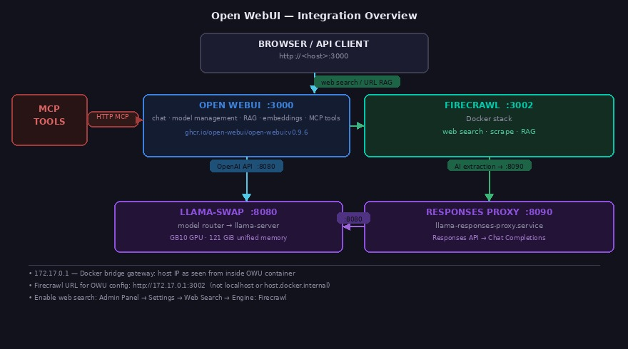

# Open WebUI Installation Guide
## NVIDIA DGX Spark (GB10)

Open WebUI is a web-based chat interface for LLMs. On this machine it runs as a Docker container,
pinned to a specific release tag, managed by a systemd service. It connects to llama-swap
(the local model proxy) as its AI backend.

[](images/openwebui-integration.jpg)

- **Version:** v0.9.5
- **Image:** `ghcr.io/open-webui/open-webui:v0.9.5`
- **URL:** `http://<host-ip>:3000`
- **Data volume:** Docker named volume `openwebui` → `/var/lib/docker/volumes/openwebui/_data`

> **Before starting:** Install all required software listed in [`prerequisites.md`](prerequisites.md).

---

## Prerequisites

- Docker installed and the `sysadmin` user in the `docker` group
- llama-swap running on port 8080 (Open WebUI connects to it as the AI backend)
- Log directory created before first start

```bash
# Verify Docker
docker --version   # Docker version 29.2.1 or later

# Verify user is in docker group
groups | grep docker
# If missing: sudo usermod -aG docker $USER && newgrp docker
```

---

## 1. Create the Log Directory

```bash
sudo mkdir -p /var/log/openwebui
sudo chown sysadmin:sysadmin /var/log/openwebui
```

---

## 2. Pull the Image

Pin to the exact version tag rather than `main` or `latest` to prevent unintended upgrades
on service restarts.

```bash
docker pull ghcr.io/open-webui/open-webui:v0.9.5
```

Verify the image is present:

```bash
docker images ghcr.io/open-webui/open-webui
```

---

## 3. Create the Docker Volume

The named volume persists all user data (accounts, chat history, model configs, embeddings, etc.)
across container restarts and upgrades.

```bash
docker volume create openwebui
```

Inspect to confirm location:

```bash
docker volume inspect openwebui
# Mountpoint: /var/lib/docker/volumes/openwebui/_data
```

> **Important:** Never delete this volume. It contains all persistent state. Back it up before
> upgrading the container image.

---

## 4. Systemd Unit — `/etc/systemd/system/openwebui.service`

The service stops and removes the old container before each start so Docker can recreate it
cleanly with the current configuration.

```bash
sudo tee /etc/systemd/system/openwebui.service > /dev/null << 'EOF'
[Unit]
Description=OpenWebUI Docker Container
After=docker.service
Requires=docker.service

[Service]
Type=simple
User=sysadmin

ExecStartPre=-/usr/bin/docker stop openwebui
ExecStartPre=-/usr/bin/docker rm openwebui

ExecStart=/usr/bin/docker run --name openwebui \
    -p 3000:8080 \
    -v openwebui:/app/backend/data \
    ghcr.io/open-webui/open-webui:v0.9.5

ExecStop=/usr/bin/docker stop openwebui
ExecStopPost=/usr/bin/docker rm openwebui

Restart=always
RestartSec=10

StandardOutput=append:/var/log/openwebui/openwebui.log
StandardError=append:/var/log/openwebui/openwebui.log

NoNewPrivileges=true
PrivateTmp=true
ProtectSystem=full
ProtectHome=false

[Install]
WantedBy=multi-user.target
EOF
```

Enable and start:

```bash
sudo systemctl daemon-reload
sudo systemctl enable openwebui.service
sudo systemctl start openwebui.service
sudo systemctl status openwebui.service
```

---

## 5. Verify

```bash
# Container is running and healthy
docker ps | grep openwebui
docker inspect openwebui --format '{{.State.Health.Status}}'
# → healthy  (takes ~60–90 seconds after first start)

# API responds
curl -s http://localhost:3000/api/version
# → {"version":"0.9.5","deployment_id":""}

# HTTP health endpoint
curl -o /dev/null -w "%{http_code}" http://localhost:3000/health
# → 200

# Tail logs
tail -f /var/log/openwebui/openwebui.log
```

---

## 6. First-Run Setup

On first launch, navigate to `http://<host-ip>:3000` in a browser and complete the setup wizard:

1. Create the admin account (email + password).
2. Open WebUI will redirect to the chat interface.

### Connect to llama-swap

Open WebUI connects to llama-swap as an OpenAI-compatible backend. Configure this in the admin panel:

1. Go to **Admin Panel → Settings → Connections**.
2. Under **OpenAI API**, set the base URL to `http://172.17.0.1:8080/v1`
   (`172.17.0.1` is the Docker bridge gateway — how the container reaches the host).
3. Set any non-empty API key (llama-swap does not validate keys).
4. Save. The model list from llama-swap will populate automatically.

### Set Context Windows per Model

After connecting, set the context window for each model to match the llama-swap configuration.
This can be done via script — see the admin API example below — or manually in the model editor.

```bash
# Retrieve your API key from Admin Panel → Account → API Keys
API_KEY="sk-..."

curl -s -X POST "http://localhost:3000/api/v1/models/model/update?id=gpt-oss-120b" \
  -H "Authorization: Bearer $API_KEY" \
  -H "Content-Type: application/json" \
  -d '{"id":"gpt-oss-120b","name":"gpt-oss-120B","base_model_id":null,"meta":{},"params":{"num_ctx":131072},"access_grants":[],"is_active":true}'
```

Refer to the context window table in `llama-swap.md` for per-model values.

---

## 7. MCP Tool Servers

Open WebUI supports MCP (Model Context Protocol) servers as tool backends. Tools allow models
to search the web, query databases, call APIs, and more during chat sessions.

### Architecture

Open WebUI connects to MCP servers via **Streamable HTTP** (not stdio). Since most MCP servers
are stdio-based, `mcp-proxy` is used to bridge them to HTTP:

```
Open WebUI (Docker) → http://<host-ip>:<port>/mcp → mcp-proxy → stdio MCP server
```

### Connecting an MCP Server

Use the admin API to register an MCP server. The `url` field must contain the **full URL
including the path** — Open WebUI's MCP client uses the `url` value directly and ignores the
`path` field when establishing the connection.

```bash
curl -s -X POST http://localhost:3000/api/v1/configs/tool_servers \
  -H "Authorization: Bearer <YOUR_API_KEY>" \
  -H "Content-Type: application/json" \
  -d '{
    "TOOL_SERVER_CONNECTIONS": [
      {
        "url": "http://<host-ip>:<port>/mcp",
        "path": "/mcp",
        "type": "mcp",
        "auth_type": "none",
        "key": "",
        "config": {"enable": true},
        "info": {"id": "<server-id>", "name": "<Display Name>"}
      }
    ]
  }'
```

To add multiple servers, include all entries in the `TOOL_SERVER_CONNECTIONS` array — the
API replaces the entire list on each call.

### Verifying a Connection

```bash
curl -s -X POST http://localhost:3000/api/v1/configs/tool_servers/verify \
  -H "Authorization: Bearer <YOUR_API_KEY>" \
  -H "Content-Type: application/json" \
  -d '{
    "url": "http://<host-ip>:<port>/mcp",
    "path": "/mcp",
    "type": "mcp",
    "auth_type": "none",
    "key": "",
    "config": {"enable": true},
    "info": {"id": "<server-id>", "name": "<Display Name>"}
  }'
```

A successful response returns `{"status": true, "specs": [...]}` listing available tools.

### Currently Registered MCP Servers

None configured.

### Enabling Tools in a Chat

In the Open WebUI chat interface, click the **+** button or **Tools** (wrench) icon at the
bottom of the input bar and toggle the desired tool on. The model will call it automatically
when relevant.

Via the API, pass `"tool_ids": ["server:mcp:<server-id>"]` in the request body.

### Notes for MCP Tools

**`function_calling: native` is required.** Open WebUI has two tool-calling modes:

| Mode | How it works | Result |
|---|---|---|
| Default (non-native) | Injects tool specs as text into the prompt | Most models ignore this |
| `function_calling: "native"` | Passes tools as OpenAI function definitions | Model makes proper tool calls |

Without `function_calling: "native"` in the model's params, the model will never call MCP
tools — it will answer from training data instead. Set this on every model that uses MCP servers.

**`defaultFeatureIds` does not auto-enable MCP tools.** The `defaultFeatureIds` field controls
built-in Open WebUI features (`web_search`, `code_interpreter`, `image_generation`). Adding an
MCP tool ID here has no effect — MCP tools require the user to toggle them on per chat session.

---

## 8. Firecrawl Integration (Web Search & URL RAG)

Firecrawl provides live web search and URL-based RAG loading. OWU calls Firecrawl at
`http://172.17.0.1:3002` — `172.17.0.1` is the Docker bridge gateway (how the OWU container
reaches the host). `localhost` and `host.docker.internal` do not work because OWU and Firecrawl
run on different Docker networks.

### Prerequisites

Firecrawl must be running: `init.firecrawl status`. See [`Firecrawl.md`](Firecrawl.md) for setup.

### Configure via API

Get an admin token first:

```bash
curl -s http://localhost:3000/api/v1/auths/signin \
  -H "Content-Type: application/json" \
  -d '{"email":"admin@example.com","password":"YOUR_PASSWORD"}' \
  | jq -r '.token'
```

Then apply the full config in one step:

```python
python3 - <<'PYEOF'
import json, urllib.request

TOKEN = "paste-token-here"
BASE  = "http://localhost:3000"
HDR   = {"Authorization": f"Bearer {TOKEN}", "Content-Type": "application/json"}

req = urllib.request.Request(f"{BASE}/api/v1/retrieval/config", headers=HDR)
cfg = json.loads(urllib.request.urlopen(req).read())

cfg["web"]["ENABLE_WEB_SEARCH"]      = True
cfg["web"]["WEB_SEARCH_ENGINE"]      = "firecrawl"
cfg["web"]["FIRECRAWL_API_BASE_URL"] = "http://172.17.0.1:3002"
cfg["web"]["FIRECRAWL_API_KEY"]      = "none"
cfg["web"]["WEB_LOADER_ENGINE"]      = "firecrawl"

body = json.dumps(cfg).encode()
req2 = urllib.request.Request(f"{BASE}/api/v1/retrieval/config/update",
                               data=body, headers=HDR, method="POST")
resp = json.loads(urllib.request.urlopen(req2).read())
print("WEB_SEARCH_ENGINE:    ", resp["web"]["WEB_SEARCH_ENGINE"])
print("FIRECRAWL_API_BASE_URL:", resp["web"]["FIRECRAWL_API_BASE_URL"])
print("WEB_LOADER_ENGINE:    ", resp["web"]["WEB_LOADER_ENGINE"])
PYEOF
```

### Usage in chat

| Feature | How to trigger |
|---|---|
| Web search | Click the 🌐 globe icon before sending — OWU queries Firecrawl `/v2/search`, embeds results, injects as context |
| URL RAG | Click the paperclip → paste a URL — OWU calls Firecrawl `/v2/scrape`, extracts markdown, injects as context |

### API flag (programmatic)

```bash
curl -s http://localhost:3000/api/v1/chat/completions \
  -H "Authorization: Bearer $TOKEN" \
  -H "Content-Type: application/json" \
  -d '{
    "model": "gpt-oss-120b",
    "messages": [{"role":"user","content":"What is the latest Python version?"}],
    "features": {"web_search": true},
    "stream": false
  }'
```

---

## 9. Upgrading Open WebUI to a New Version

1. Pull the new image:
   ```bash
   docker pull ghcr.io/open-webui/open-webui:vX.Y.Z
   ```

2. Update the image tag in the service file:
   ```bash
   sudo sed -i 's|open-webui:v.*|open-webui:vX.Y.Z|' /etc/systemd/system/openwebui.service
   sudo systemctl daemon-reload
   ```

3. Restart the service:
   ```bash
   sudo systemctl restart openwebui.service
   ```

4. Confirm the running container uses the new image:
   ```bash
   docker inspect openwebui --format '{{.Config.Image}}'
   curl -s http://localhost:3000/api/version
   ```

---

## 10. Service Manager Script

`/home/sysadmin/codebase/bin/init.openwebui` manages the service:

```bash
init.openwebui start
init.openwebui stop
init.openwebui restart
init.openwebui reload    # daemon-reload then restart
init.openwebui status
init.openwebui logs      # tail the log file
```

### Script source

```bash
sudo tee /home/sysadmin/codebase/bin/init.openwebui > /dev/null << 'EOF'
#!/usr/bin/env bash
# init.openwebui — Open WebUI Service Manager
set -euo pipefail
SERVICE="openwebui.service"
LOG_FILE="/var/log/openwebui/openwebui.log"
RED='\033[0;31m'; GREEN='\033[0;32m'; YELLOW='\033[1;33m'
CYAN='\033[0;36m'; BOLD='\033[1m'; RESET='\033[0m'
info()    { echo -e "${CYAN}[INFO]${RESET}  $*"; }
success() { echo -e "${GREEN}[OK]${RESET}    $*"; }
error()   { echo -e "${RED}[ERROR]${RESET} $*" >&2; }
die()     { error "$*"; exit 1; }
separator() { echo -e "${CYAN}$(printf '─%.0s' {1..60})${RESET}"; }
require_systemctl() { command -v systemctl &>/dev/null || die "systemctl not found."; }
usage() {
    echo -e "\n${BOLD}init.openwebui${RESET} — Open WebUI Service Manager\n"
    echo -e "${BOLD}COMMANDS${RESET}"
    echo -e "  start | stop | restart | reload | status | logs | help"
}
cmd_start()   { info "Starting ${SERVICE}…"; sudo systemctl start "$SERVICE" && success "Started." || die "Failed."; separator; cmd_status; }
cmd_stop()    { info "Stopping ${SERVICE}…"; sudo systemctl stop "$SERVICE" && success "Stopped." || die "Failed."; }
cmd_restart() { info "Restarting ${SERVICE}…"; sudo systemctl restart "$SERVICE" && success "Restarted." || die "Failed."; separator; cmd_status; }
cmd_reload()  { info "Reloading daemon…"; sudo systemctl daemon-reload && success "Reloaded." || die "Failed."; cmd_restart; }
cmd_status() {
    info "Status of ${SERVICE}:"; separator
    sudo systemctl status "$SERVICE" --no-pager -l || true; separator
    info "Recent logs:"
    local since; since=$(systemctl show "$SERVICE" -p ActiveEnterTimestamp --value 2>/dev/null)
    if [[ -n "$since" && "$since" != "n/a" ]]; then sudo journalctl -u "$SERVICE" --since="$since" --no-pager || true
    else sudo journalctl -u "$SERVICE" -n 20 --no-pager || true; fi; separator
}
cmd_logs() { info "Tailing ${LOG_FILE}  (Ctrl-C to exit)"; separator; sudo tail -f "$LOG_FILE"; }
main() {
    require_systemctl
    case "${1:-help}" in
        start) cmd_start;; stop) cmd_stop;; restart) cmd_restart;;
        reload) cmd_reload;; status) cmd_status;; logs) cmd_logs;;
        help|--help|-h) usage;;
        *) error "Unknown command: '$1'"; usage; exit 1;;
    esac
}
main "$@"
EOF
sudo chmod 755 /home/sysadmin/codebase/bin/init.openwebui
```

---

## 11. Key Paths

| Path | Purpose |
|---|---|
| `/etc/systemd/system/openwebui.service` | Systemd unit |
| `/var/log/openwebui/openwebui.log` | Log file |
| `/var/lib/docker/volumes/openwebui/_data` | Persistent data (host path of named volume) |
| `/app/backend/data` | Data path inside the container |

---

## Container Environment Notes

The container runs Python 3.11 (upstream base image). Telemetry and analytics are disabled at
build time (`SCARF_NO_ANALYTICS=true`, `DO_NOT_TRACK=true`, `ANONYMIZED_TELEMETRY=false`).
The Ollama integration is disabled (`USE_OLLAMA_DOCKER=false`); the connection to llama-swap
is configured via the OpenAI API endpoint in the admin UI.

No GPU passthrough is required for the container — GPU inference is handled by llama-swap on
the host; Open WebUI is CPU-only (serving the web UI and doing embeddings in software).
